---
jupyter:
  colab:
    toc_visible: true
  kernelspec:
    display_name: Python 3
    name: python3
  language_info:
    name: python
  nbformat: 4
  nbformat_minor: 0
---

::: {.cell .markdown id="pYqU7GOhkxgp"}
# **Ismail Ben seddik - Homework 1 - Question 2**

*Applied Machine Learning (CSCI-P 556 by Zoran Tiganj - Fall 2023)*

------------------------------------------------------------------------

## **Graduate Admission Prediction**

Dataset obtained from:
<https://www.kaggle.com/datasets/mohansacharya/graduate-admissions>

It contains the following attributes which are considered important in
the selection process of graduate students:

1.  GRE Scores (out of 340)
2.  TOEFL Scores (out of 120)
3.  University Rating (out of 5)
4.  Statement of Purpose (strength out of 5)
5.  Letter of Recommendation (strength out of 5)
6.  Undergraduate GPA (out of 10)
7.  Research Experience (either 0 or 1)
8.  Chance of Admit (ranging from 0 to 1)
:::

::: {.cell .markdown id="1DfJAFWwl7hu"}
# Requirements
:::

::: {.cell .code execution_count="262" id="12eGAvYHkjDb"}
``` python
# Basic dataframe and array manipulation
import pandas as pd
import numpy as np

# Data preprocessing
from sklearn.preprocessing import LabelBinarizer
from sklearn.model_selection import train_test_split
from sklearn.utils import shuffle
from sklearn import metrics

# Visualization
import matplotlib.pyplot as plt
import seaborn as sns
from pandas.plotting import scatter_matrix

# Regression
from sklearn.linear_model import LinearRegression
from sklearn.linear_model import SGDRegressor
from sklearn.linear_model import Ridge
from sklearn.linear_model import Lasso
from sklearn.linear_model import ElasticNet

# Polynomial Regression
from sklearn.preprocessing import PolynomialFeatures
from sklearn.compose import ColumnTransformer
from sklearn.pipeline import Pipeline

# Regression evaluation
from sklearn.metrics import mean_squared_error
from sklearn.model_selection import cross_val_score
```
:::

::: {.cell .code execution_count="55" colab="{\"base_uri\":\"https://localhost:8080/\",\"height\":206}" id="3talI1KsmEDp" outputId="53e3971e-342e-4a7d-c057-2a718d35b8be"}
``` python
# add dataset to the content directory on the left
df = pd.read_csv('/content/admission_prediction.csv')
df.head()
```

::: {.output .execute_result execution_count="55"}
```{=html}

  <div id="df-0077dd9f-a6b0-4835-9466-cebd3f079e3f" class="colab-df-container">
    <div>
<style scoped>
    .dataframe tbody tr th:only-of-type {
        vertical-align: middle;
    }

    .dataframe tbody tr th {
        vertical-align: top;
    }

    .dataframe thead th {
        text-align: right;
    }
</style>
<table border="1" class="dataframe">
  <thead>
    <tr style="text-align: right;">
      <th></th>
      <th>Serial No.</th>
      <th>GRE Score</th>
      <th>TOEFL Score</th>
      <th>University Rating</th>
      <th>SOP</th>
      <th>LOR</th>
      <th>CGPA</th>
      <th>Research</th>
      <th>Chance of Admit</th>
    </tr>
  </thead>
  <tbody>
    <tr>
      <th>0</th>
      <td>1</td>
      <td>337</td>
      <td>118</td>
      <td>4</td>
      <td>4.5</td>
      <td>4.5</td>
      <td>9.65</td>
      <td>1</td>
      <td>0.92</td>
    </tr>
    <tr>
      <th>1</th>
      <td>2</td>
      <td>324</td>
      <td>107</td>
      <td>4</td>
      <td>4.0</td>
      <td>4.5</td>
      <td>8.87</td>
      <td>1</td>
      <td>0.76</td>
    </tr>
    <tr>
      <th>2</th>
      <td>3</td>
      <td>316</td>
      <td>104</td>
      <td>3</td>
      <td>3.0</td>
      <td>3.5</td>
      <td>8.00</td>
      <td>1</td>
      <td>0.72</td>
    </tr>
    <tr>
      <th>3</th>
      <td>4</td>
      <td>322</td>
      <td>110</td>
      <td>3</td>
      <td>3.5</td>
      <td>2.5</td>
      <td>8.67</td>
      <td>1</td>
      <td>0.80</td>
    </tr>
    <tr>
      <th>4</th>
      <td>5</td>
      <td>314</td>
      <td>103</td>
      <td>2</td>
      <td>2.0</td>
      <td>3.0</td>
      <td>8.21</td>
      <td>0</td>
      <td>0.65</td>
    </tr>
  </tbody>
</table>
</div>
    <div class="colab-df-buttons">

  <div class="colab-df-container">
    <button class="colab-df-convert" onclick="convertToInteractive('df-0077dd9f-a6b0-4835-9466-cebd3f079e3f')"
            title="Convert this dataframe to an interactive table."
            style="display:none;">

  <svg xmlns="http://www.w3.org/2000/svg" height="24px" viewBox="0 -960 960 960">
    <path d="M120-120v-720h720v720H120Zm60-500h600v-160H180v160Zm220 220h160v-160H400v160Zm0 220h160v-160H400v160ZM180-400h160v-160H180v160Zm440 0h160v-160H620v160ZM180-180h160v-160H180v160Zm440 0h160v-160H620v160Z"/>
  </svg>
    </button>

  <style>
    .colab-df-container {
      display:flex;
      gap: 12px;
    }

    .colab-df-convert {
      background-color: #E8F0FE;
      border: none;
      border-radius: 50%;
      cursor: pointer;
      display: none;
      fill: #1967D2;
      height: 32px;
      padding: 0 0 0 0;
      width: 32px;
    }

    .colab-df-convert:hover {
      background-color: #E2EBFA;
      box-shadow: 0px 1px 2px rgba(60, 64, 67, 0.3), 0px 1px 3px 1px rgba(60, 64, 67, 0.15);
      fill: #174EA6;
    }

    .colab-df-buttons div {
      margin-bottom: 4px;
    }

    [theme=dark] .colab-df-convert {
      background-color: #3B4455;
      fill: #D2E3FC;
    }

    [theme=dark] .colab-df-convert:hover {
      background-color: #434B5C;
      box-shadow: 0px 1px 3px 1px rgba(0, 0, 0, 0.15);
      filter: drop-shadow(0px 1px 2px rgba(0, 0, 0, 0.3));
      fill: #FFFFFF;
    }
  </style>

    <script>
      const buttonEl =
        document.querySelector('#df-0077dd9f-a6b0-4835-9466-cebd3f079e3f button.colab-df-convert');
      buttonEl.style.display =
        google.colab.kernel.accessAllowed ? 'block' : 'none';

      async function convertToInteractive(key) {
        const element = document.querySelector('#df-0077dd9f-a6b0-4835-9466-cebd3f079e3f');
        const dataTable =
          await google.colab.kernel.invokeFunction('convertToInteractive',
                                                    [key], {});
        if (!dataTable) return;

        const docLinkHtml = 'Like what you see? Visit the ' +
          '<a target="_blank" href=https://colab.research.google.com/notebooks/data_table.ipynb>data table notebook</a>'
          + ' to learn more about interactive tables.';
        element.innerHTML = '';
        dataTable['output_type'] = 'display_data';
        await google.colab.output.renderOutput(dataTable, element);
        const docLink = document.createElement('div');
        docLink.innerHTML = docLinkHtml;
        element.appendChild(docLink);
      }
    </script>
  </div>


<div id="df-53617498-6a0e-47f1-93c9-df0d694f7d4d">
  <button class="colab-df-quickchart" onclick="quickchart('df-53617498-6a0e-47f1-93c9-df0d694f7d4d')"
            title="Suggest charts."
            style="display:none;">

<svg xmlns="http://www.w3.org/2000/svg" height="24px"viewBox="0 0 24 24"
     width="24px">
    <g>
        <path d="M19 3H5c-1.1 0-2 .9-2 2v14c0 1.1.9 2 2 2h14c1.1 0 2-.9 2-2V5c0-1.1-.9-2-2-2zM9 17H7v-7h2v7zm4 0h-2V7h2v10zm4 0h-2v-4h2v4z"/>
    </g>
</svg>
  </button>

<style>
  .colab-df-quickchart {
      --bg-color: #E8F0FE;
      --fill-color: #1967D2;
      --hover-bg-color: #E2EBFA;
      --hover-fill-color: #174EA6;
      --disabled-fill-color: #AAA;
      --disabled-bg-color: #DDD;
  }

  [theme=dark] .colab-df-quickchart {
      --bg-color: #3B4455;
      --fill-color: #D2E3FC;
      --hover-bg-color: #434B5C;
      --hover-fill-color: #FFFFFF;
      --disabled-bg-color: #3B4455;
      --disabled-fill-color: #666;
  }

  .colab-df-quickchart {
    background-color: var(--bg-color);
    border: none;
    border-radius: 50%;
    cursor: pointer;
    display: none;
    fill: var(--fill-color);
    height: 32px;
    padding: 0;
    width: 32px;
  }

  .colab-df-quickchart:hover {
    background-color: var(--hover-bg-color);
    box-shadow: 0 1px 2px rgba(60, 64, 67, 0.3), 0 1px 3px 1px rgba(60, 64, 67, 0.15);
    fill: var(--button-hover-fill-color);
  }

  .colab-df-quickchart-complete:disabled,
  .colab-df-quickchart-complete:disabled:hover {
    background-color: var(--disabled-bg-color);
    fill: var(--disabled-fill-color);
    box-shadow: none;
  }

  .colab-df-spinner {
    border: 2px solid var(--fill-color);
    border-color: transparent;
    border-bottom-color: var(--fill-color);
    animation:
      spin 1s steps(1) infinite;
  }

  @keyframes spin {
    0% {
      border-color: transparent;
      border-bottom-color: var(--fill-color);
      border-left-color: var(--fill-color);
    }
    20% {
      border-color: transparent;
      border-left-color: var(--fill-color);
      border-top-color: var(--fill-color);
    }
    30% {
      border-color: transparent;
      border-left-color: var(--fill-color);
      border-top-color: var(--fill-color);
      border-right-color: var(--fill-color);
    }
    40% {
      border-color: transparent;
      border-right-color: var(--fill-color);
      border-top-color: var(--fill-color);
    }
    60% {
      border-color: transparent;
      border-right-color: var(--fill-color);
    }
    80% {
      border-color: transparent;
      border-right-color: var(--fill-color);
      border-bottom-color: var(--fill-color);
    }
    90% {
      border-color: transparent;
      border-bottom-color: var(--fill-color);
    }
  }
</style>

  <script>
    async function quickchart(key) {
      const quickchartButtonEl =
        document.querySelector('#' + key + ' button');
      quickchartButtonEl.disabled = true;  // To prevent multiple clicks.
      quickchartButtonEl.classList.add('colab-df-spinner');
      try {
        const charts = await google.colab.kernel.invokeFunction(
            'suggestCharts', [key], {});
      } catch (error) {
        console.error('Error during call to suggestCharts:', error);
      }
      quickchartButtonEl.classList.remove('colab-df-spinner');
      quickchartButtonEl.classList.add('colab-df-quickchart-complete');
    }
    (() => {
      let quickchartButtonEl =
        document.querySelector('#df-53617498-6a0e-47f1-93c9-df0d694f7d4d button');
      quickchartButtonEl.style.display =
        google.colab.kernel.accessAllowed ? 'block' : 'none';
    })();
  </script>
</div>
    </div>
  </div>
```
:::
:::

::: {.cell .code execution_count="56" colab="{\"base_uri\":\"https://localhost:8080/\",\"height\":206}" id="sODwf_9874VO" outputId="e236d91d-7416-43fc-b4f6-8cecd08be960"}
``` python
# shuffling the data
df_shuffled = shuffle(df, random_state=42)
df_shuffled.head()
```

::: {.output .execute_result execution_count="56"}
```{=html}

  <div id="df-873c7495-09e4-4538-bda1-209ea629c318" class="colab-df-container">
    <div>
<style scoped>
    .dataframe tbody tr th:only-of-type {
        vertical-align: middle;
    }

    .dataframe tbody tr th {
        vertical-align: top;
    }

    .dataframe thead th {
        text-align: right;
    }
</style>
<table border="1" class="dataframe">
  <thead>
    <tr style="text-align: right;">
      <th></th>
      <th>Serial No.</th>
      <th>GRE Score</th>
      <th>TOEFL Score</th>
      <th>University Rating</th>
      <th>SOP</th>
      <th>LOR</th>
      <th>CGPA</th>
      <th>Research</th>
      <th>Chance of Admit</th>
    </tr>
  </thead>
  <tbody>
    <tr>
      <th>361</th>
      <td>362</td>
      <td>334</td>
      <td>116</td>
      <td>4</td>
      <td>4.0</td>
      <td>3.5</td>
      <td>9.54</td>
      <td>1</td>
      <td>0.93</td>
    </tr>
    <tr>
      <th>73</th>
      <td>74</td>
      <td>314</td>
      <td>108</td>
      <td>4</td>
      <td>4.5</td>
      <td>4.0</td>
      <td>9.04</td>
      <td>1</td>
      <td>0.84</td>
    </tr>
    <tr>
      <th>374</th>
      <td>375</td>
      <td>315</td>
      <td>105</td>
      <td>2</td>
      <td>2.0</td>
      <td>2.5</td>
      <td>7.65</td>
      <td>0</td>
      <td>0.39</td>
    </tr>
    <tr>
      <th>155</th>
      <td>156</td>
      <td>312</td>
      <td>109</td>
      <td>3</td>
      <td>3.0</td>
      <td>3.0</td>
      <td>8.69</td>
      <td>0</td>
      <td>0.77</td>
    </tr>
    <tr>
      <th>104</th>
      <td>105</td>
      <td>326</td>
      <td>112</td>
      <td>3</td>
      <td>3.5</td>
      <td>3.0</td>
      <td>9.05</td>
      <td>1</td>
      <td>0.74</td>
    </tr>
  </tbody>
</table>
</div>
    <div class="colab-df-buttons">

  <div class="colab-df-container">
    <button class="colab-df-convert" onclick="convertToInteractive('df-873c7495-09e4-4538-bda1-209ea629c318')"
            title="Convert this dataframe to an interactive table."
            style="display:none;">

  <svg xmlns="http://www.w3.org/2000/svg" height="24px" viewBox="0 -960 960 960">
    <path d="M120-120v-720h720v720H120Zm60-500h600v-160H180v160Zm220 220h160v-160H400v160Zm0 220h160v-160H400v160ZM180-400h160v-160H180v160Zm440 0h160v-160H620v160ZM180-180h160v-160H180v160Zm440 0h160v-160H620v160Z"/>
  </svg>
    </button>

  <style>
    .colab-df-container {
      display:flex;
      gap: 12px;
    }

    .colab-df-convert {
      background-color: #E8F0FE;
      border: none;
      border-radius: 50%;
      cursor: pointer;
      display: none;
      fill: #1967D2;
      height: 32px;
      padding: 0 0 0 0;
      width: 32px;
    }

    .colab-df-convert:hover {
      background-color: #E2EBFA;
      box-shadow: 0px 1px 2px rgba(60, 64, 67, 0.3), 0px 1px 3px 1px rgba(60, 64, 67, 0.15);
      fill: #174EA6;
    }

    .colab-df-buttons div {
      margin-bottom: 4px;
    }

    [theme=dark] .colab-df-convert {
      background-color: #3B4455;
      fill: #D2E3FC;
    }

    [theme=dark] .colab-df-convert:hover {
      background-color: #434B5C;
      box-shadow: 0px 1px 3px 1px rgba(0, 0, 0, 0.15);
      filter: drop-shadow(0px 1px 2px rgba(0, 0, 0, 0.3));
      fill: #FFFFFF;
    }
  </style>

    <script>
      const buttonEl =
        document.querySelector('#df-873c7495-09e4-4538-bda1-209ea629c318 button.colab-df-convert');
      buttonEl.style.display =
        google.colab.kernel.accessAllowed ? 'block' : 'none';

      async function convertToInteractive(key) {
        const element = document.querySelector('#df-873c7495-09e4-4538-bda1-209ea629c318');
        const dataTable =
          await google.colab.kernel.invokeFunction('convertToInteractive',
                                                    [key], {});
        if (!dataTable) return;

        const docLinkHtml = 'Like what you see? Visit the ' +
          '<a target="_blank" href=https://colab.research.google.com/notebooks/data_table.ipynb>data table notebook</a>'
          + ' to learn more about interactive tables.';
        element.innerHTML = '';
        dataTable['output_type'] = 'display_data';
        await google.colab.output.renderOutput(dataTable, element);
        const docLink = document.createElement('div');
        docLink.innerHTML = docLinkHtml;
        element.appendChild(docLink);
      }
    </script>
  </div>


<div id="df-5257a803-5294-4d71-8241-5d4d5ff52c5a">
  <button class="colab-df-quickchart" onclick="quickchart('df-5257a803-5294-4d71-8241-5d4d5ff52c5a')"
            title="Suggest charts."
            style="display:none;">

<svg xmlns="http://www.w3.org/2000/svg" height="24px"viewBox="0 0 24 24"
     width="24px">
    <g>
        <path d="M19 3H5c-1.1 0-2 .9-2 2v14c0 1.1.9 2 2 2h14c1.1 0 2-.9 2-2V5c0-1.1-.9-2-2-2zM9 17H7v-7h2v7zm4 0h-2V7h2v10zm4 0h-2v-4h2v4z"/>
    </g>
</svg>
  </button>

<style>
  .colab-df-quickchart {
      --bg-color: #E8F0FE;
      --fill-color: #1967D2;
      --hover-bg-color: #E2EBFA;
      --hover-fill-color: #174EA6;
      --disabled-fill-color: #AAA;
      --disabled-bg-color: #DDD;
  }

  [theme=dark] .colab-df-quickchart {
      --bg-color: #3B4455;
      --fill-color: #D2E3FC;
      --hover-bg-color: #434B5C;
      --hover-fill-color: #FFFFFF;
      --disabled-bg-color: #3B4455;
      --disabled-fill-color: #666;
  }

  .colab-df-quickchart {
    background-color: var(--bg-color);
    border: none;
    border-radius: 50%;
    cursor: pointer;
    display: none;
    fill: var(--fill-color);
    height: 32px;
    padding: 0;
    width: 32px;
  }

  .colab-df-quickchart:hover {
    background-color: var(--hover-bg-color);
    box-shadow: 0 1px 2px rgba(60, 64, 67, 0.3), 0 1px 3px 1px rgba(60, 64, 67, 0.15);
    fill: var(--button-hover-fill-color);
  }

  .colab-df-quickchart-complete:disabled,
  .colab-df-quickchart-complete:disabled:hover {
    background-color: var(--disabled-bg-color);
    fill: var(--disabled-fill-color);
    box-shadow: none;
  }

  .colab-df-spinner {
    border: 2px solid var(--fill-color);
    border-color: transparent;
    border-bottom-color: var(--fill-color);
    animation:
      spin 1s steps(1) infinite;
  }

  @keyframes spin {
    0% {
      border-color: transparent;
      border-bottom-color: var(--fill-color);
      border-left-color: var(--fill-color);
    }
    20% {
      border-color: transparent;
      border-left-color: var(--fill-color);
      border-top-color: var(--fill-color);
    }
    30% {
      border-color: transparent;
      border-left-color: var(--fill-color);
      border-top-color: var(--fill-color);
      border-right-color: var(--fill-color);
    }
    40% {
      border-color: transparent;
      border-right-color: var(--fill-color);
      border-top-color: var(--fill-color);
    }
    60% {
      border-color: transparent;
      border-right-color: var(--fill-color);
    }
    80% {
      border-color: transparent;
      border-right-color: var(--fill-color);
      border-bottom-color: var(--fill-color);
    }
    90% {
      border-color: transparent;
      border-bottom-color: var(--fill-color);
    }
  }
</style>

  <script>
    async function quickchart(key) {
      const quickchartButtonEl =
        document.querySelector('#' + key + ' button');
      quickchartButtonEl.disabled = true;  // To prevent multiple clicks.
      quickchartButtonEl.classList.add('colab-df-spinner');
      try {
        const charts = await google.colab.kernel.invokeFunction(
            'suggestCharts', [key], {});
      } catch (error) {
        console.error('Error during call to suggestCharts:', error);
      }
      quickchartButtonEl.classList.remove('colab-df-spinner');
      quickchartButtonEl.classList.add('colab-df-quickchart-complete');
    }
    (() => {
      let quickchartButtonEl =
        document.querySelector('#df-5257a803-5294-4d71-8241-5d4d5ff52c5a button');
      quickchartButtonEl.style.display =
        google.colab.kernel.accessAllowed ? 'block' : 'none';
    })();
  </script>
</div>
    </div>
  </div>
```
:::
:::

::: {.cell .markdown id="BM_nYPaFr6KJ"}
# Question A

Summarize the data. How much data is present? What attributes/features
are continuous valued? Which attributes are categorical?
:::

::: {.cell .code execution_count="57" colab="{\"base_uri\":\"https://localhost:8080/\",\"height\":0}" id="AwJfl6JUmcV0" outputId="3ee06735-388d-4d66-bc87-e0519e61281b"}
``` python
df_shuffled.info()
```

::: {.output .stream .stdout}
    <class 'pandas.core.frame.DataFrame'>
    Int64Index: 500 entries, 361 to 102
    Data columns (total 9 columns):
     #   Column             Non-Null Count  Dtype  
    ---  ------             --------------  -----  
     0   Serial No.         500 non-null    int64  
     1   GRE Score          500 non-null    int64  
     2   TOEFL Score        500 non-null    int64  
     3   University Rating  500 non-null    int64  
     4   SOP                500 non-null    float64
     5   LOR                500 non-null    float64
     6   CGPA               500 non-null    float64
     7   Research           500 non-null    int64  
     8   Chance of Admit    500 non-null    float64
    dtypes: float64(4), int64(5)
    memory usage: 39.1 KB
:::
:::

::: {.cell .markdown id="5fJv4rjavhnS"}
-   There are 9 attributes.\
-   There are 500 instances/entries in the dataset.
-   The 4 attributes printed below are continuous-valued:
:::

::: {.cell .code execution_count="58" colab="{\"base_uri\":\"https://localhost:8080/\",\"height\":0}" id="9uK6txZMrxpI" outputId="5b34b211-aa8f-48bf-d773-54bd46a0069a"}
``` python
df_shuffled.select_dtypes(include=['float64']).columns.tolist()
```

::: {.output .execute_result execution_count="58"}
    ['SOP', 'LOR ', 'CGPA', 'Chance of Admit ']
:::
:::

::: {.cell .markdown id="roaQH-Hez7Ne"}
Note: As detailed below, SOP and LOR are assumed to take on any values
from 0 to 5 (not only categorical grades)
:::

::: {.cell .code execution_count="59" colab="{\"base_uri\":\"https://localhost:8080/\",\"height\":0}" id="YRsVhCgKwGq1" outputId="f2428e12-bb9a-4325-d849-16be76843d2e"}
``` python
df_shuffled['University Rating'].value_counts()
```

::: {.output .execute_result execution_count="59"}
    3    162
    2    126
    4    105
    5     73
    1     34
    Name: University Rating, dtype: int64
:::
:::

::: {.cell .code execution_count="60" colab="{\"base_uri\":\"https://localhost:8080/\",\"height\":0}" id="o5frImSrxQu9" outputId="268cc5a5-2c72-4c9e-9900-e2719284003e"}
``` python
df_shuffled['Research'].value_counts()
```

::: {.output .execute_result execution_count="60"}
    1    280
    0    220
    Name: Research, dtype: int64
:::
:::

::: {.cell .code execution_count="61" colab="{\"base_uri\":\"https://localhost:8080/\",\"height\":0}" id="EEIwAdUCxVa3" outputId="672ae80e-08c0-43f6-aef7-5174b9f4099a"}
``` python
df_shuffled['SOP'].value_counts()
```

::: {.output .execute_result execution_count="61"}
    4.0    89
    3.5    88
    3.0    80
    2.5    64
    4.5    63
    2.0    43
    5.0    42
    1.5    25
    1.0     6
    Name: SOP, dtype: int64
:::
:::

::: {.cell .code execution_count="62" colab="{\"base_uri\":\"https://localhost:8080/\",\"height\":0}" id="MPAUCDczxqcq" outputId="82e91c89-e07a-41de-a8b9-c24313b4c317"}
``` python
df_shuffled['LOR '].value_counts()
```

::: {.output .execute_result execution_count="62"}
    3.0    99
    4.0    94
    3.5    86
    4.5    63
    2.5    50
    5.0    50
    2.0    46
    1.5    11
    1.0     1
    Name: LOR , dtype: int64
:::
:::

::: {.cell .markdown id="NqchhnfCy8-g"}
-   When it comes to categorical attributes, there are some initial
    assumptions to be established. Manifestly, ***Research*** and
    ***University Rating*** are categorical because they take only
    specific values that repeat across different instances.
-   Now, ***SOP*** and ***LOR*** look like they take categorical grades.
    Yet, seen that they are grades out of 5, they are assumed to take
    any values from 0 to 5. So, they are not considered categorical (as
    if they can only take values increasing by 0.5 from 0 to 5).
:::

::: {.cell .markdown id="bW7_e4IC2c4h"}
# Question B

Display the statistical values for each of the attributes, along with
visualizations (e.g., histogram) of the distributions for each
attribute. Explain noticeable traits for key attributes. Are there any
attributes that might require special treatment? If so, what special
treatment might they require?
:::

::: {.cell .markdown id="vwl1eKvD2vM8"}
## Visualization and summary statistics
:::

::: {.cell .code execution_count="63" colab="{\"base_uri\":\"https://localhost:8080/\",\"height\":300}" id="6B6p8KwOxuz-" outputId="0e289b40-4cfd-4d7d-8c65-fb19e485b653"}
``` python
df_shuffled.describe()
```

::: {.output .execute_result execution_count="63"}
```{=html}

  <div id="df-3a7bf1b3-8b61-41ea-86f1-6fe1d8436e18" class="colab-df-container">
    <div>
<style scoped>
    .dataframe tbody tr th:only-of-type {
        vertical-align: middle;
    }

    .dataframe tbody tr th {
        vertical-align: top;
    }

    .dataframe thead th {
        text-align: right;
    }
</style>
<table border="1" class="dataframe">
  <thead>
    <tr style="text-align: right;">
      <th></th>
      <th>Serial No.</th>
      <th>GRE Score</th>
      <th>TOEFL Score</th>
      <th>University Rating</th>
      <th>SOP</th>
      <th>LOR</th>
      <th>CGPA</th>
      <th>Research</th>
      <th>Chance of Admit</th>
    </tr>
  </thead>
  <tbody>
    <tr>
      <th>count</th>
      <td>500.000000</td>
      <td>500.000000</td>
      <td>500.000000</td>
      <td>500.000000</td>
      <td>500.000000</td>
      <td>500.00000</td>
      <td>500.000000</td>
      <td>500.000000</td>
      <td>500.00000</td>
    </tr>
    <tr>
      <th>mean</th>
      <td>250.500000</td>
      <td>316.472000</td>
      <td>107.192000</td>
      <td>3.114000</td>
      <td>3.374000</td>
      <td>3.48400</td>
      <td>8.576440</td>
      <td>0.560000</td>
      <td>0.72174</td>
    </tr>
    <tr>
      <th>std</th>
      <td>144.481833</td>
      <td>11.295148</td>
      <td>6.081868</td>
      <td>1.143512</td>
      <td>0.991004</td>
      <td>0.92545</td>
      <td>0.604813</td>
      <td>0.496884</td>
      <td>0.14114</td>
    </tr>
    <tr>
      <th>min</th>
      <td>1.000000</td>
      <td>290.000000</td>
      <td>92.000000</td>
      <td>1.000000</td>
      <td>1.000000</td>
      <td>1.00000</td>
      <td>6.800000</td>
      <td>0.000000</td>
      <td>0.34000</td>
    </tr>
    <tr>
      <th>25%</th>
      <td>125.750000</td>
      <td>308.000000</td>
      <td>103.000000</td>
      <td>2.000000</td>
      <td>2.500000</td>
      <td>3.00000</td>
      <td>8.127500</td>
      <td>0.000000</td>
      <td>0.63000</td>
    </tr>
    <tr>
      <th>50%</th>
      <td>250.500000</td>
      <td>317.000000</td>
      <td>107.000000</td>
      <td>3.000000</td>
      <td>3.500000</td>
      <td>3.50000</td>
      <td>8.560000</td>
      <td>1.000000</td>
      <td>0.72000</td>
    </tr>
    <tr>
      <th>75%</th>
      <td>375.250000</td>
      <td>325.000000</td>
      <td>112.000000</td>
      <td>4.000000</td>
      <td>4.000000</td>
      <td>4.00000</td>
      <td>9.040000</td>
      <td>1.000000</td>
      <td>0.82000</td>
    </tr>
    <tr>
      <th>max</th>
      <td>500.000000</td>
      <td>340.000000</td>
      <td>120.000000</td>
      <td>5.000000</td>
      <td>5.000000</td>
      <td>5.00000</td>
      <td>9.920000</td>
      <td>1.000000</td>
      <td>0.97000</td>
    </tr>
  </tbody>
</table>
</div>
    <div class="colab-df-buttons">

  <div class="colab-df-container">
    <button class="colab-df-convert" onclick="convertToInteractive('df-3a7bf1b3-8b61-41ea-86f1-6fe1d8436e18')"
            title="Convert this dataframe to an interactive table."
            style="display:none;">

  <svg xmlns="http://www.w3.org/2000/svg" height="24px" viewBox="0 -960 960 960">
    <path d="M120-120v-720h720v720H120Zm60-500h600v-160H180v160Zm220 220h160v-160H400v160Zm0 220h160v-160H400v160ZM180-400h160v-160H180v160Zm440 0h160v-160H620v160ZM180-180h160v-160H180v160Zm440 0h160v-160H620v160Z"/>
  </svg>
    </button>

  <style>
    .colab-df-container {
      display:flex;
      gap: 12px;
    }

    .colab-df-convert {
      background-color: #E8F0FE;
      border: none;
      border-radius: 50%;
      cursor: pointer;
      display: none;
      fill: #1967D2;
      height: 32px;
      padding: 0 0 0 0;
      width: 32px;
    }

    .colab-df-convert:hover {
      background-color: #E2EBFA;
      box-shadow: 0px 1px 2px rgba(60, 64, 67, 0.3), 0px 1px 3px 1px rgba(60, 64, 67, 0.15);
      fill: #174EA6;
    }

    .colab-df-buttons div {
      margin-bottom: 4px;
    }

    [theme=dark] .colab-df-convert {
      background-color: #3B4455;
      fill: #D2E3FC;
    }

    [theme=dark] .colab-df-convert:hover {
      background-color: #434B5C;
      box-shadow: 0px 1px 3px 1px rgba(0, 0, 0, 0.15);
      filter: drop-shadow(0px 1px 2px rgba(0, 0, 0, 0.3));
      fill: #FFFFFF;
    }
  </style>

    <script>
      const buttonEl =
        document.querySelector('#df-3a7bf1b3-8b61-41ea-86f1-6fe1d8436e18 button.colab-df-convert');
      buttonEl.style.display =
        google.colab.kernel.accessAllowed ? 'block' : 'none';

      async function convertToInteractive(key) {
        const element = document.querySelector('#df-3a7bf1b3-8b61-41ea-86f1-6fe1d8436e18');
        const dataTable =
          await google.colab.kernel.invokeFunction('convertToInteractive',
                                                    [key], {});
        if (!dataTable) return;

        const docLinkHtml = 'Like what you see? Visit the ' +
          '<a target="_blank" href=https://colab.research.google.com/notebooks/data_table.ipynb>data table notebook</a>'
          + ' to learn more about interactive tables.';
        element.innerHTML = '';
        dataTable['output_type'] = 'display_data';
        await google.colab.output.renderOutput(dataTable, element);
        const docLink = document.createElement('div');
        docLink.innerHTML = docLinkHtml;
        element.appendChild(docLink);
      }
    </script>
  </div>


<div id="df-b98815e4-2e85-4f94-8db1-22ce98774192">
  <button class="colab-df-quickchart" onclick="quickchart('df-b98815e4-2e85-4f94-8db1-22ce98774192')"
            title="Suggest charts."
            style="display:none;">

<svg xmlns="http://www.w3.org/2000/svg" height="24px"viewBox="0 0 24 24"
     width="24px">
    <g>
        <path d="M19 3H5c-1.1 0-2 .9-2 2v14c0 1.1.9 2 2 2h14c1.1 0 2-.9 2-2V5c0-1.1-.9-2-2-2zM9 17H7v-7h2v7zm4 0h-2V7h2v10zm4 0h-2v-4h2v4z"/>
    </g>
</svg>
  </button>

<style>
  .colab-df-quickchart {
      --bg-color: #E8F0FE;
      --fill-color: #1967D2;
      --hover-bg-color: #E2EBFA;
      --hover-fill-color: #174EA6;
      --disabled-fill-color: #AAA;
      --disabled-bg-color: #DDD;
  }

  [theme=dark] .colab-df-quickchart {
      --bg-color: #3B4455;
      --fill-color: #D2E3FC;
      --hover-bg-color: #434B5C;
      --hover-fill-color: #FFFFFF;
      --disabled-bg-color: #3B4455;
      --disabled-fill-color: #666;
  }

  .colab-df-quickchart {
    background-color: var(--bg-color);
    border: none;
    border-radius: 50%;
    cursor: pointer;
    display: none;
    fill: var(--fill-color);
    height: 32px;
    padding: 0;
    width: 32px;
  }

  .colab-df-quickchart:hover {
    background-color: var(--hover-bg-color);
    box-shadow: 0 1px 2px rgba(60, 64, 67, 0.3), 0 1px 3px 1px rgba(60, 64, 67, 0.15);
    fill: var(--button-hover-fill-color);
  }

  .colab-df-quickchart-complete:disabled,
  .colab-df-quickchart-complete:disabled:hover {
    background-color: var(--disabled-bg-color);
    fill: var(--disabled-fill-color);
    box-shadow: none;
  }

  .colab-df-spinner {
    border: 2px solid var(--fill-color);
    border-color: transparent;
    border-bottom-color: var(--fill-color);
    animation:
      spin 1s steps(1) infinite;
  }

  @keyframes spin {
    0% {
      border-color: transparent;
      border-bottom-color: var(--fill-color);
      border-left-color: var(--fill-color);
    }
    20% {
      border-color: transparent;
      border-left-color: var(--fill-color);
      border-top-color: var(--fill-color);
    }
    30% {
      border-color: transparent;
      border-left-color: var(--fill-color);
      border-top-color: var(--fill-color);
      border-right-color: var(--fill-color);
    }
    40% {
      border-color: transparent;
      border-right-color: var(--fill-color);
      border-top-color: var(--fill-color);
    }
    60% {
      border-color: transparent;
      border-right-color: var(--fill-color);
    }
    80% {
      border-color: transparent;
      border-right-color: var(--fill-color);
      border-bottom-color: var(--fill-color);
    }
    90% {
      border-color: transparent;
      border-bottom-color: var(--fill-color);
    }
  }
</style>

  <script>
    async function quickchart(key) {
      const quickchartButtonEl =
        document.querySelector('#' + key + ' button');
      quickchartButtonEl.disabled = true;  // To prevent multiple clicks.
      quickchartButtonEl.classList.add('colab-df-spinner');
      try {
        const charts = await google.colab.kernel.invokeFunction(
            'suggestCharts', [key], {});
      } catch (error) {
        console.error('Error during call to suggestCharts:', error);
      }
      quickchartButtonEl.classList.remove('colab-df-spinner');
      quickchartButtonEl.classList.add('colab-df-quickchart-complete');
    }
    (() => {
      let quickchartButtonEl =
        document.querySelector('#df-b98815e4-2e85-4f94-8db1-22ce98774192 button');
      quickchartButtonEl.style.display =
        google.colab.kernel.accessAllowed ? 'block' : 'none';
    })();
  </script>
</div>
    </div>
  </div>
```
:::
:::

::: {.cell .code execution_count="65" id="S5dMWX9AYbkx"}
``` python
# Serial No. is just an enumeration of entries, so we can drop it
df_shuffled.drop('Serial No.', axis = 1, inplace = True)
```
:::

::: {.cell .code execution_count="66" id="J3vy-QJLaGHC"}
``` python
# list of features
features = [x for x in df_shuffled.columns]
```
:::

::: {.cell .markdown id="VJnoTIInX_MU"}
#### Histograms
:::

::: {.cell .code execution_count="73" colab="{\"base_uri\":\"https://localhost:8080/\",\"height\":1482}" id="IZcfXvofX7xl" outputId="54fe454d-770b-4cbd-af7a-b64cdc033e1e"}
``` python
fig, ax = plt.subplots(len(features), figsize = (7,35))
for i, feature in enumerate(features):
  sns.histplot(df_shuffled[feature], ax=ax[i])
  ax[i].set_xlabel(feature, fontsize=8)
plt.show()
```

::: {.output .display_data}
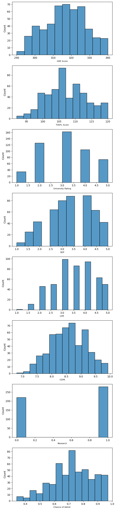
:::
:::

::: {.cell .markdown id="m2f2Pu2peBNk"}
#### Box Plot and Violin Combo
:::

::: {.cell .code execution_count="79" colab="{\"base_uri\":\"https://localhost:8080/\",\"height\":2680}" id="-RMkwh9CYXB4" outputId="032c553e-5d44-4692-bd74-30684f5265bf"}
``` python
fig, ax = plt.subplots(len(features), figsize = (4,40))
for i, feature in enumerate(features):
  sns.boxplot(y=df_shuffled[feature], ax=ax[i], boxprops={'zorder': 2}, width=0.2, palette='rocket')
  sns.violinplot(y=df_shuffled[feature], ax=ax[i], color = "#af52f4")
  ax[i].set_xlabel(feature, fontsize=8)
plt.show()
```

::: {.output .display_data}
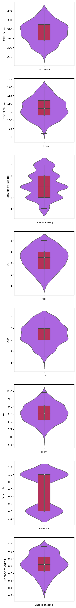
:::
:::

::: {.cell .code execution_count="80" colab="{\"base_uri\":\"https://localhost:8080/\",\"height\":0}" id="FxNIOhkTey8X" outputId="9347d75f-dd35-488f-fa51-99937b568917"}
``` python
df_shuffled.isnull().sum()
```

::: {.output .execute_result execution_count="80"}
    GRE Score            0
    TOEFL Score          0
    University Rating    0
    SOP                  0
    LOR                  0
    CGPA                 0
    Research             0
    Chance of Admit      0
    dtype: int64
:::
:::

::: {.cell .markdown id="6XiQM2vEkCvJ"}
## Special Treatment Needed
:::

::: {.cell .markdown id="DstS6lJ7g0Bw"}
-   Since ***Serial No.*** is not very useful in predicting admissions,
    it was dropped from the dataset.
-   Nothing seems out of the ordinary. None of the other attributes seem
    to require any special treatment.
-   As a matter of fact, attributes seem to be very well distributed.
    Most of the values are centered around the mean. Aside from
    **Research**, evidently, the attributes\' values almost hint at a
    Gaussian distribution.
:::

::: {.cell .markdown id="IBJ8nQxbkdIT"}
# Question C

Analyze and discuss the relationships between the data attributes, and
between the data attributes and label. This involves computing the
Pearson Correlation Coefficient (PCC) and generating scatter plots.
:::

::: {.cell .markdown id="aWmRCwnklCis"}
#### Scatter Plots and Correlation Coefficients
:::

::: {.cell .code execution_count="81" colab="{\"base_uri\":\"https://localhost:8080/\",\"height\":877}" id="m1l7-8xcjCxM" outputId="434cfb51-3eef-4388-9f4f-410577d836ba"}
``` python
scatter_matrix(df_shuffled[features], figsize=(20, 16))
plt.show()
```

::: {.output .display_data}
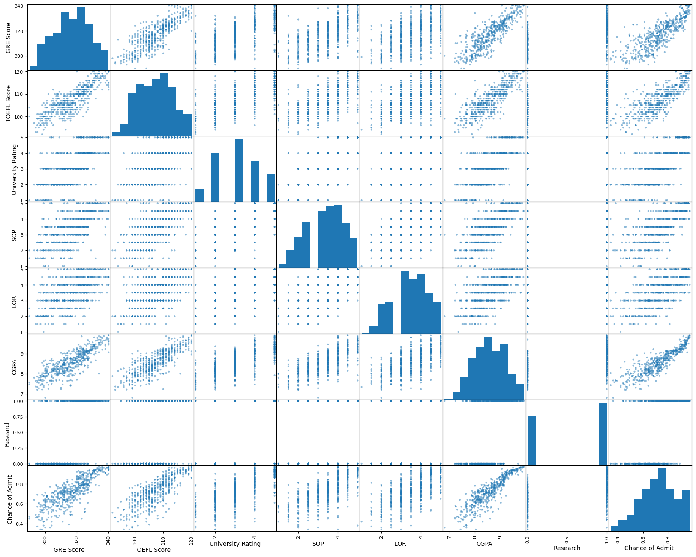
:::
:::

::: {.cell .code execution_count="82" colab="{\"base_uri\":\"https://localhost:8080/\",\"height\":300}" id="VpK93TPtlNk1" outputId="0dfe51ac-f784-490a-b92c-75cdaba830ab"}
``` python
df_shuffled[features].corr()
```

::: {.output .execute_result execution_count="82"}
```{=html}

  <div id="df-1d920ec5-d4c0-4694-bfd4-8b35ce762964" class="colab-df-container">
    <div>
<style scoped>
    .dataframe tbody tr th:only-of-type {
        vertical-align: middle;
    }

    .dataframe tbody tr th {
        vertical-align: top;
    }

    .dataframe thead th {
        text-align: right;
    }
</style>
<table border="1" class="dataframe">
  <thead>
    <tr style="text-align: right;">
      <th></th>
      <th>GRE Score</th>
      <th>TOEFL Score</th>
      <th>University Rating</th>
      <th>SOP</th>
      <th>LOR</th>
      <th>CGPA</th>
      <th>Research</th>
      <th>Chance of Admit</th>
    </tr>
  </thead>
  <tbody>
    <tr>
      <th>GRE Score</th>
      <td>1.000000</td>
      <td>0.827200</td>
      <td>0.635376</td>
      <td>0.613498</td>
      <td>0.524679</td>
      <td>0.825878</td>
      <td>0.563398</td>
      <td>0.810351</td>
    </tr>
    <tr>
      <th>TOEFL Score</th>
      <td>0.827200</td>
      <td>1.000000</td>
      <td>0.649799</td>
      <td>0.644410</td>
      <td>0.541563</td>
      <td>0.810574</td>
      <td>0.467012</td>
      <td>0.792228</td>
    </tr>
    <tr>
      <th>University Rating</th>
      <td>0.635376</td>
      <td>0.649799</td>
      <td>1.000000</td>
      <td>0.728024</td>
      <td>0.608651</td>
      <td>0.705254</td>
      <td>0.427047</td>
      <td>0.690132</td>
    </tr>
    <tr>
      <th>SOP</th>
      <td>0.613498</td>
      <td>0.644410</td>
      <td>0.728024</td>
      <td>1.000000</td>
      <td>0.663707</td>
      <td>0.712154</td>
      <td>0.408116</td>
      <td>0.684137</td>
    </tr>
    <tr>
      <th>LOR</th>
      <td>0.524679</td>
      <td>0.541563</td>
      <td>0.608651</td>
      <td>0.663707</td>
      <td>1.000000</td>
      <td>0.637469</td>
      <td>0.372526</td>
      <td>0.645365</td>
    </tr>
    <tr>
      <th>CGPA</th>
      <td>0.825878</td>
      <td>0.810574</td>
      <td>0.705254</td>
      <td>0.712154</td>
      <td>0.637469</td>
      <td>1.000000</td>
      <td>0.501311</td>
      <td>0.882413</td>
    </tr>
    <tr>
      <th>Research</th>
      <td>0.563398</td>
      <td>0.467012</td>
      <td>0.427047</td>
      <td>0.408116</td>
      <td>0.372526</td>
      <td>0.501311</td>
      <td>1.000000</td>
      <td>0.545871</td>
    </tr>
    <tr>
      <th>Chance of Admit</th>
      <td>0.810351</td>
      <td>0.792228</td>
      <td>0.690132</td>
      <td>0.684137</td>
      <td>0.645365</td>
      <td>0.882413</td>
      <td>0.545871</td>
      <td>1.000000</td>
    </tr>
  </tbody>
</table>
</div>
    <div class="colab-df-buttons">

  <div class="colab-df-container">
    <button class="colab-df-convert" onclick="convertToInteractive('df-1d920ec5-d4c0-4694-bfd4-8b35ce762964')"
            title="Convert this dataframe to an interactive table."
            style="display:none;">

  <svg xmlns="http://www.w3.org/2000/svg" height="24px" viewBox="0 -960 960 960">
    <path d="M120-120v-720h720v720H120Zm60-500h600v-160H180v160Zm220 220h160v-160H400v160Zm0 220h160v-160H400v160ZM180-400h160v-160H180v160Zm440 0h160v-160H620v160ZM180-180h160v-160H180v160Zm440 0h160v-160H620v160Z"/>
  </svg>
    </button>

  <style>
    .colab-df-container {
      display:flex;
      gap: 12px;
    }

    .colab-df-convert {
      background-color: #E8F0FE;
      border: none;
      border-radius: 50%;
      cursor: pointer;
      display: none;
      fill: #1967D2;
      height: 32px;
      padding: 0 0 0 0;
      width: 32px;
    }

    .colab-df-convert:hover {
      background-color: #E2EBFA;
      box-shadow: 0px 1px 2px rgba(60, 64, 67, 0.3), 0px 1px 3px 1px rgba(60, 64, 67, 0.15);
      fill: #174EA6;
    }

    .colab-df-buttons div {
      margin-bottom: 4px;
    }

    [theme=dark] .colab-df-convert {
      background-color: #3B4455;
      fill: #D2E3FC;
    }

    [theme=dark] .colab-df-convert:hover {
      background-color: #434B5C;
      box-shadow: 0px 1px 3px 1px rgba(0, 0, 0, 0.15);
      filter: drop-shadow(0px 1px 2px rgba(0, 0, 0, 0.3));
      fill: #FFFFFF;
    }
  </style>

    <script>
      const buttonEl =
        document.querySelector('#df-1d920ec5-d4c0-4694-bfd4-8b35ce762964 button.colab-df-convert');
      buttonEl.style.display =
        google.colab.kernel.accessAllowed ? 'block' : 'none';

      async function convertToInteractive(key) {
        const element = document.querySelector('#df-1d920ec5-d4c0-4694-bfd4-8b35ce762964');
        const dataTable =
          await google.colab.kernel.invokeFunction('convertToInteractive',
                                                    [key], {});
        if (!dataTable) return;

        const docLinkHtml = 'Like what you see? Visit the ' +
          '<a target="_blank" href=https://colab.research.google.com/notebooks/data_table.ipynb>data table notebook</a>'
          + ' to learn more about interactive tables.';
        element.innerHTML = '';
        dataTable['output_type'] = 'display_data';
        await google.colab.output.renderOutput(dataTable, element);
        const docLink = document.createElement('div');
        docLink.innerHTML = docLinkHtml;
        element.appendChild(docLink);
      }
    </script>
  </div>


<div id="df-b0d27d87-a091-45dd-8fbc-7bdc3c21e581">
  <button class="colab-df-quickchart" onclick="quickchart('df-b0d27d87-a091-45dd-8fbc-7bdc3c21e581')"
            title="Suggest charts."
            style="display:none;">

<svg xmlns="http://www.w3.org/2000/svg" height="24px"viewBox="0 0 24 24"
     width="24px">
    <g>
        <path d="M19 3H5c-1.1 0-2 .9-2 2v14c0 1.1.9 2 2 2h14c1.1 0 2-.9 2-2V5c0-1.1-.9-2-2-2zM9 17H7v-7h2v7zm4 0h-2V7h2v10zm4 0h-2v-4h2v4z"/>
    </g>
</svg>
  </button>

<style>
  .colab-df-quickchart {
      --bg-color: #E8F0FE;
      --fill-color: #1967D2;
      --hover-bg-color: #E2EBFA;
      --hover-fill-color: #174EA6;
      --disabled-fill-color: #AAA;
      --disabled-bg-color: #DDD;
  }

  [theme=dark] .colab-df-quickchart {
      --bg-color: #3B4455;
      --fill-color: #D2E3FC;
      --hover-bg-color: #434B5C;
      --hover-fill-color: #FFFFFF;
      --disabled-bg-color: #3B4455;
      --disabled-fill-color: #666;
  }

  .colab-df-quickchart {
    background-color: var(--bg-color);
    border: none;
    border-radius: 50%;
    cursor: pointer;
    display: none;
    fill: var(--fill-color);
    height: 32px;
    padding: 0;
    width: 32px;
  }

  .colab-df-quickchart:hover {
    background-color: var(--hover-bg-color);
    box-shadow: 0 1px 2px rgba(60, 64, 67, 0.3), 0 1px 3px 1px rgba(60, 64, 67, 0.15);
    fill: var(--button-hover-fill-color);
  }

  .colab-df-quickchart-complete:disabled,
  .colab-df-quickchart-complete:disabled:hover {
    background-color: var(--disabled-bg-color);
    fill: var(--disabled-fill-color);
    box-shadow: none;
  }

  .colab-df-spinner {
    border: 2px solid var(--fill-color);
    border-color: transparent;
    border-bottom-color: var(--fill-color);
    animation:
      spin 1s steps(1) infinite;
  }

  @keyframes spin {
    0% {
      border-color: transparent;
      border-bottom-color: var(--fill-color);
      border-left-color: var(--fill-color);
    }
    20% {
      border-color: transparent;
      border-left-color: var(--fill-color);
      border-top-color: var(--fill-color);
    }
    30% {
      border-color: transparent;
      border-left-color: var(--fill-color);
      border-top-color: var(--fill-color);
      border-right-color: var(--fill-color);
    }
    40% {
      border-color: transparent;
      border-right-color: var(--fill-color);
      border-top-color: var(--fill-color);
    }
    60% {
      border-color: transparent;
      border-right-color: var(--fill-color);
    }
    80% {
      border-color: transparent;
      border-right-color: var(--fill-color);
      border-bottom-color: var(--fill-color);
    }
    90% {
      border-color: transparent;
      border-bottom-color: var(--fill-color);
    }
  }
</style>

  <script>
    async function quickchart(key) {
      const quickchartButtonEl =
        document.querySelector('#' + key + ' button');
      quickchartButtonEl.disabled = true;  // To prevent multiple clicks.
      quickchartButtonEl.classList.add('colab-df-spinner');
      try {
        const charts = await google.colab.kernel.invokeFunction(
            'suggestCharts', [key], {});
      } catch (error) {
        console.error('Error during call to suggestCharts:', error);
      }
      quickchartButtonEl.classList.remove('colab-df-spinner');
      quickchartButtonEl.classList.add('colab-df-quickchart-complete');
    }
    (() => {
      let quickchartButtonEl =
        document.querySelector('#df-b0d27d87-a091-45dd-8fbc-7bdc3c21e581 button');
      quickchartButtonEl.style.display =
        google.colab.kernel.accessAllowed ? 'block' : 'none';
    })();
  </script>
</div>
    </div>
  </div>
```
:::
:::

::: {.cell .markdown id="_wcz1lY1l0u6"}
#### PCC Table
:::

::: {.cell .code execution_count="285" colab="{\"base_uri\":\"https://localhost:8080/\",\"height\":535}" id="seBONFtSl0K_" outputId="9a6228f8-5289-4cfc-d24d-69d079ec8d72"}
``` python
sns.heatmap(df_shuffled[features].corr(method = 'pearson'), cbar = False, annot = True)
plt.show()
```

::: {.output .display_data}
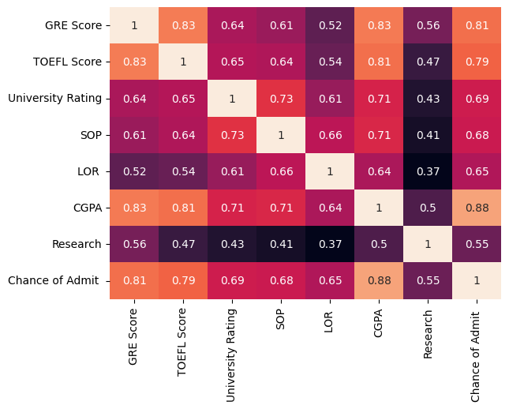
:::
:::

::: {.cell .markdown id="Z7LSUb7voAC8"}
#### Discussion
:::

::: {.cell .markdown id="91YgrZ9LoIV2"}
-   The ***CGPA*** is the most correlated feature with the ***Chance of
    Admit***. It seems like the most promising attribute to predict the
    chance of admission.
-   The ***TOEFL Score*** and ***GRE Score*** are close seconds to
    ***CGPA*** in terms of their strong correlation with ***Chance of
    Admit***.
-   This is makes sense, in actuality, as graduate school stress upon
    such scores for admission. They must be good indicators of how a
    student would perform if admitted.
-   ***TOEFL Score***, ***GRE Score*** and ***CGPA*** seem to be all
    strongly correlated among each other. Actually, these scores are
    fairly highly correlated with most other attributes. Manifestly, a
    student with higher scores is most entitled to have research
    experience and better SOP and LOR.
:::

::: {.cell .markdown id="XFOrFYnDsUHG"}
# Question D

Select 20% of the data for testing. Describe how you did that and verify
that your test portion of the data is representative of the entire
dataset
:::

::: {.cell .markdown id="1CkCp5KYwLIw"}
#### Splitting Data into Test/Train
:::

::: {.cell .markdown id="YJe-EL3Vsqs5"}
-   ***CGPA*** is the most correlated attribute with the ***Chance of
    Admit***. So, it must be quite indicative in predicting the
    ***Chance of Admit***.
-   To ensure that the test set is representative of the
    categories/ranges of CGPA in the whole dataset, we create the
    following ***CGPA_category*** attribute to capture categories of
    CGPA.
-   Looking back at the histogram of the CGPA, it looks like most values
    range between 7.5 and 9.5. Thus, labeled from 1 to 4, are the
    following CGPA categories:
:::

::: {.cell .code execution_count="85" id="EGc67QaiowgP"}
``` python
df_shuffled["CGPA_category"] = pd.cut(df_shuffled["CGPA"],
                               bins=[0, 7.5, 8.5, 9.5, np.inf],
                               labels=[1, 2, 3, 4])
```
:::

::: {.cell .code execution_count="86" colab="{\"base_uri\":\"https://localhost:8080/\",\"height\":0}" id="MxIDnKn5uO7U" outputId="dadc6feb-4777-476f-d3b1-24dfa2b89e49"}
``` python
df_shuffled["CGPA_category"].value_counts()
```

::: {.output .execute_result execution_count="86"}
    3    236
    2    213
    4     31
    1     20
    Name: CGPA_category, dtype: int64
:::
:::

::: {.cell .code execution_count="88" colab="{\"base_uri\":\"https://localhost:8080/\",\"height\":448}" id="uqQhqVW1ulku" outputId="4bdb7fa7-dfe5-451e-ab3c-247aebe364ea"}
``` python
df_shuffled["CGPA_category"].hist()
```

::: {.output .execute_result execution_count="88"}
    <Axes: >
:::

::: {.output .display_data}
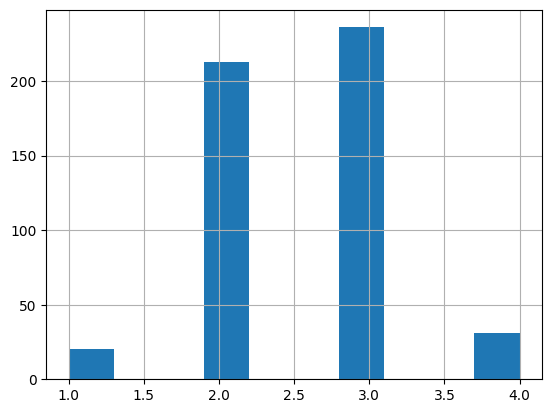
:::
:::

::: {.cell .code execution_count="89" id="geJ9-wr-vWMY"}
``` python
strat_train_set, strat_test_set = train_test_split(df_shuffled, test_size=0.2, stratify=df_shuffled["CGPA_category"], random_state=42)
```
:::

::: {.cell .code execution_count="284" colab="{\"base_uri\":\"https://localhost:8080/\",\"height\":465}" id="3C_UMEWqvpUD" outputId="ed0e2617-a985-4299-a298-4249ac80f6fc"}
``` python
# test set representation of the whole dataset
fig, ax = plt.subplots(1, figsize = (4,5))
sns.histplot(df_shuffled['CGPA_category'], ax = ax)
sns.histplot(strat_test_set['CGPA_category'], ax = ax)
plt.show()
```

::: {.output .display_data}

:::
:::

::: {.cell .markdown id="Zlw3qwiiwSvL"}
#### Verification Discussion
:::

::: {.cell .code execution_count="90" colab="{\"base_uri\":\"https://localhost:8080/\",\"height\":0}" id="IZRU20cvvx6k" outputId="5972f61f-ba56-44ee-edab-4e1d4c821538"}
``` python
strat_test_set["CGPA_category"].value_counts() / len(strat_test_set)
```

::: {.output .execute_result execution_count="90"}
    3    0.47
    2    0.43
    4    0.06
    1    0.04
    Name: CGPA_category, dtype: float64
:::
:::

::: {.cell .code execution_count="91" colab="{\"base_uri\":\"https://localhost:8080/\",\"height\":0}" id="sFB4aELZwiq5" outputId="f1a810bc-b45f-4ea2-adf5-31f08ece6f1d"}
``` python
df_shuffled["CGPA_category"].value_counts() / len(df_shuffled)
```

::: {.output .execute_result execution_count="91"}
    3    0.472
    2    0.426
    4    0.062
    1    0.040
    Name: CGPA_category, dtype: float64
:::
:::

::: {.cell .code execution_count="92" id="HmWAjlF6wqHx"}
``` python
def CGPA_category_proportions(data):
    return data["CGPA_category"].value_counts() / len(data)

train_set, test_set = train_test_split(df_shuffled, test_size=0.2, random_state=42)

compare_props = pd.DataFrame({
    "Overall": CGPA_category_proportions(df_shuffled),
    "Stratified": CGPA_category_proportions(strat_test_set),
    "Random": CGPA_category_proportions(test_set),
}).sort_index()
compare_props["Random %error"] = 100 * compare_props["Random"] / compare_props["Overall"] - 100
compare_props["Stratified %error"] = 100 * compare_props["Stratified"] / compare_props["Overall"] - 100
```
:::

::: {.cell .code execution_count="93" colab="{\"base_uri\":\"https://localhost:8080/\",\"height\":175}" id="ALrFjVfdw7w9" outputId="5eb48e90-16b2-47b6-d080-fe3fd67f4af2"}
``` python
compare_props
```

::: {.output .execute_result execution_count="93"}
```{=html}

  <div id="df-31ed24ca-fbdd-4fd1-b171-db404f4a3dba" class="colab-df-container">
    <div>
<style scoped>
    .dataframe tbody tr th:only-of-type {
        vertical-align: middle;
    }

    .dataframe tbody tr th {
        vertical-align: top;
    }

    .dataframe thead th {
        text-align: right;
    }
</style>
<table border="1" class="dataframe">
  <thead>
    <tr style="text-align: right;">
      <th></th>
      <th>Overall</th>
      <th>Stratified</th>
      <th>Random</th>
      <th>Random %error</th>
      <th>Stratified %error</th>
    </tr>
  </thead>
  <tbody>
    <tr>
      <th>1</th>
      <td>0.040</td>
      <td>0.04</td>
      <td>0.05</td>
      <td>25.000000</td>
      <td>0.000000</td>
    </tr>
    <tr>
      <th>2</th>
      <td>0.426</td>
      <td>0.43</td>
      <td>0.49</td>
      <td>15.023474</td>
      <td>0.938967</td>
    </tr>
    <tr>
      <th>3</th>
      <td>0.472</td>
      <td>0.47</td>
      <td>0.41</td>
      <td>-13.135593</td>
      <td>-0.423729</td>
    </tr>
    <tr>
      <th>4</th>
      <td>0.062</td>
      <td>0.06</td>
      <td>0.05</td>
      <td>-19.354839</td>
      <td>-3.225806</td>
    </tr>
  </tbody>
</table>
</div>
    <div class="colab-df-buttons">

  <div class="colab-df-container">
    <button class="colab-df-convert" onclick="convertToInteractive('df-31ed24ca-fbdd-4fd1-b171-db404f4a3dba')"
            title="Convert this dataframe to an interactive table."
            style="display:none;">

  <svg xmlns="http://www.w3.org/2000/svg" height="24px" viewBox="0 -960 960 960">
    <path d="M120-120v-720h720v720H120Zm60-500h600v-160H180v160Zm220 220h160v-160H400v160Zm0 220h160v-160H400v160ZM180-400h160v-160H180v160Zm440 0h160v-160H620v160ZM180-180h160v-160H180v160Zm440 0h160v-160H620v160Z"/>
  </svg>
    </button>

  <style>
    .colab-df-container {
      display:flex;
      gap: 12px;
    }

    .colab-df-convert {
      background-color: #E8F0FE;
      border: none;
      border-radius: 50%;
      cursor: pointer;
      display: none;
      fill: #1967D2;
      height: 32px;
      padding: 0 0 0 0;
      width: 32px;
    }

    .colab-df-convert:hover {
      background-color: #E2EBFA;
      box-shadow: 0px 1px 2px rgba(60, 64, 67, 0.3), 0px 1px 3px 1px rgba(60, 64, 67, 0.15);
      fill: #174EA6;
    }

    .colab-df-buttons div {
      margin-bottom: 4px;
    }

    [theme=dark] .colab-df-convert {
      background-color: #3B4455;
      fill: #D2E3FC;
    }

    [theme=dark] .colab-df-convert:hover {
      background-color: #434B5C;
      box-shadow: 0px 1px 3px 1px rgba(0, 0, 0, 0.15);
      filter: drop-shadow(0px 1px 2px rgba(0, 0, 0, 0.3));
      fill: #FFFFFF;
    }
  </style>

    <script>
      const buttonEl =
        document.querySelector('#df-31ed24ca-fbdd-4fd1-b171-db404f4a3dba button.colab-df-convert');
      buttonEl.style.display =
        google.colab.kernel.accessAllowed ? 'block' : 'none';

      async function convertToInteractive(key) {
        const element = document.querySelector('#df-31ed24ca-fbdd-4fd1-b171-db404f4a3dba');
        const dataTable =
          await google.colab.kernel.invokeFunction('convertToInteractive',
                                                    [key], {});
        if (!dataTable) return;

        const docLinkHtml = 'Like what you see? Visit the ' +
          '<a target="_blank" href=https://colab.research.google.com/notebooks/data_table.ipynb>data table notebook</a>'
          + ' to learn more about interactive tables.';
        element.innerHTML = '';
        dataTable['output_type'] = 'display_data';
        await google.colab.output.renderOutput(dataTable, element);
        const docLink = document.createElement('div');
        docLink.innerHTML = docLinkHtml;
        element.appendChild(docLink);
      }
    </script>
  </div>


<div id="df-ef24b803-e039-40ba-b850-c79b5428654e">
  <button class="colab-df-quickchart" onclick="quickchart('df-ef24b803-e039-40ba-b850-c79b5428654e')"
            title="Suggest charts."
            style="display:none;">

<svg xmlns="http://www.w3.org/2000/svg" height="24px"viewBox="0 0 24 24"
     width="24px">
    <g>
        <path d="M19 3H5c-1.1 0-2 .9-2 2v14c0 1.1.9 2 2 2h14c1.1 0 2-.9 2-2V5c0-1.1-.9-2-2-2zM9 17H7v-7h2v7zm4 0h-2V7h2v10zm4 0h-2v-4h2v4z"/>
    </g>
</svg>
  </button>

<style>
  .colab-df-quickchart {
      --bg-color: #E8F0FE;
      --fill-color: #1967D2;
      --hover-bg-color: #E2EBFA;
      --hover-fill-color: #174EA6;
      --disabled-fill-color: #AAA;
      --disabled-bg-color: #DDD;
  }

  [theme=dark] .colab-df-quickchart {
      --bg-color: #3B4455;
      --fill-color: #D2E3FC;
      --hover-bg-color: #434B5C;
      --hover-fill-color: #FFFFFF;
      --disabled-bg-color: #3B4455;
      --disabled-fill-color: #666;
  }

  .colab-df-quickchart {
    background-color: var(--bg-color);
    border: none;
    border-radius: 50%;
    cursor: pointer;
    display: none;
    fill: var(--fill-color);
    height: 32px;
    padding: 0;
    width: 32px;
  }

  .colab-df-quickchart:hover {
    background-color: var(--hover-bg-color);
    box-shadow: 0 1px 2px rgba(60, 64, 67, 0.3), 0 1px 3px 1px rgba(60, 64, 67, 0.15);
    fill: var(--button-hover-fill-color);
  }

  .colab-df-quickchart-complete:disabled,
  .colab-df-quickchart-complete:disabled:hover {
    background-color: var(--disabled-bg-color);
    fill: var(--disabled-fill-color);
    box-shadow: none;
  }

  .colab-df-spinner {
    border: 2px solid var(--fill-color);
    border-color: transparent;
    border-bottom-color: var(--fill-color);
    animation:
      spin 1s steps(1) infinite;
  }

  @keyframes spin {
    0% {
      border-color: transparent;
      border-bottom-color: var(--fill-color);
      border-left-color: var(--fill-color);
    }
    20% {
      border-color: transparent;
      border-left-color: var(--fill-color);
      border-top-color: var(--fill-color);
    }
    30% {
      border-color: transparent;
      border-left-color: var(--fill-color);
      border-top-color: var(--fill-color);
      border-right-color: var(--fill-color);
    }
    40% {
      border-color: transparent;
      border-right-color: var(--fill-color);
      border-top-color: var(--fill-color);
    }
    60% {
      border-color: transparent;
      border-right-color: var(--fill-color);
    }
    80% {
      border-color: transparent;
      border-right-color: var(--fill-color);
      border-bottom-color: var(--fill-color);
    }
    90% {
      border-color: transparent;
      border-bottom-color: var(--fill-color);
    }
  }
</style>

  <script>
    async function quickchart(key) {
      const quickchartButtonEl =
        document.querySelector('#' + key + ' button');
      quickchartButtonEl.disabled = true;  // To prevent multiple clicks.
      quickchartButtonEl.classList.add('colab-df-spinner');
      try {
        const charts = await google.colab.kernel.invokeFunction(
            'suggestCharts', [key], {});
      } catch (error) {
        console.error('Error during call to suggestCharts:', error);
      }
      quickchartButtonEl.classList.remove('colab-df-spinner');
      quickchartButtonEl.classList.add('colab-df-quickchart-complete');
    }
    (() => {
      let quickchartButtonEl =
        document.querySelector('#df-ef24b803-e039-40ba-b850-c79b5428654e button');
      quickchartButtonEl.style.display =
        google.colab.kernel.accessAllowed ? 'block' : 'none';
    })();
  </script>
</div>
    </div>
  </div>
```
:::
:::

::: {.cell .markdown id="pxpNkC-xw_5K"}
-   To ensure that the test set is representative of the whole dataset,
    Stratified Sampling was used to create it.
-   First, the data was divided based on the ***CGPA_category*** to
    which each instance belongs because the ***CGPA*** has the strongest
    correlation with the ***Chance of Admit***, and the distribution of
    the most relevant feature in the training and testing sets ought to
    be preserved.
-   Samples are picked from each ***CGPA_category*** in proportion to
    its size vis-à-vis the whole dataset. This way, the test set will be
    representative of the various CGPA categories (i.e., representative
    of the dataset).
-   The test set obtained using stratified sampling and the dataset show
    very close values in terms of the ratios of the unique
    ***CGPA_category*** values to the sizes of the sets. This is enough
    to verify that the test set is indeed representative of the entire
    dataset, and that the distribution of ***CGPA_category*** is
    maintained. For the sake of comparison (table above), the error
    rates of the stratified test set are far inferior to those of the
    randomly generated test set. This demonstrates the effect of
    stratified sampling in generating testing and training sets.
:::

::: {.cell .markdown id="fROm_69Ey0mL"}
#Question E Train a Linear Regression model using the training data with
four-fold cross-validation using appropriate evaluation metric. Do this
with a closed-form solution (using the Normal Equation or SVD) and with
SGD. Perform Ridge, Lasso and Elastic Net regularization -- try a few
values of penalty term and describe its impact. Explore the impact of
other hyperparameters, like batch size and learning rate (no need for
grid search). Describe your findings. For SGD, display the training and
validation loss as a function of training iteration.
:::

::: {.cell .code execution_count="97" colab="{\"base_uri\":\"https://localhost:8080/\",\"height\":0}" id="6ANgyuF4zUo3" outputId="99d5df91-9d73-4215-e271-a9488838e797"}
``` python
attributes = strat_train_set.drop("Chance of Admit ", axis=1)
labels = strat_train_set["Chance of Admit "].copy()
attributes.shape, labels.shape
```

::: {.output .execute_result execution_count="97"}
    ((400, 8), (400,))
:::
:::

::: {.cell .code execution_count="98" id="dL1CNDjEz-oL"}
``` python
def display_scores(scores):
    """Displays the scores, their mean, and the standard deviation.

    # Arguments:
        scores, np.array: list of scores given by the cross validation procedure.
    """
    print("Scores:", scores)
    print("Mean:", scores.mean())
    print("Standard Deviation:", scores.std())
```
:::

::: {.cell .markdown id="eFJfQRBQzu-6"}
#### Closed-form Solution
:::

::: {.cell .code execution_count="100" colab="{\"base_uri\":\"https://localhost:8080/\",\"height\":0}" id="thsPS5GDw9x7" outputId="0946bef7-1920-4ca8-e766-559148dbd563"}
``` python
lin_reg = LinearRegression()
lin_reg.fit(X=attributes, y=labels)

scores = cross_val_score(lin_reg, attributes, labels, cv=4, scoring='neg_mean_squared_error')
mse_scores = np.sqrt(-scores)
display_scores(mse_scores)
```

::: {.output .stream .stdout}
    Scores: [0.07039282 0.05423218 0.06218008 0.04888565]
    Mean: 0.05892268130766588
    Standard Deviation: 0.00813814411396563
:::
:::

::: {.cell .markdown id="4LfI46TV1N6j"}
#### SGD
:::

::: {.cell .code execution_count="191" colab="{\"base_uri\":\"https://localhost:8080/\",\"height\":0}" id="nK0c5wQS0LQh" outputId="80765203-f233-4d66-af5a-bee7325e342c"}
``` python
sgd_reg = SGDRegressor(penalty=None, tol = 1e-3, max_iter=1000, eta0=0.00001)
sgd_reg.fit(X=attributes, y=labels)

scores = cross_val_score(sgd_reg, attributes, labels, cv=4, scoring='neg_mean_squared_error')
mse_scores = np.sqrt(-scores)
display_scores(mse_scores)
```

::: {.output .stream .stdout}
    Scores: [0.1243823  0.11836994 0.12164754 0.11187074]
    Mean: 0.11906762893156486
    Standard Deviation: 0.004668608482225226
:::
:::

::: {.cell .code execution_count="103" id="b5Sg9qcx1UmW"}
``` python
sgd_reg_train = SGDRegressor(penalty=None, tol = 1e-3, max_iter=10000, eta0=0.00001, warm_start=True, random_state=42)
sgd_reg_val = SGDRegressor(penalty=None, tol = 1e-3, max_iter=10000, eta0=0.00001, warm_start=True, random_state=42)

X_train, X_val, y_train, y_val = train_test_split(attributes, labels, test_size=0.2, random_state=42)

errors_training = []
errors_validation = []

for epoch in range(10000):
  sgd_reg_val.fit(X_train, y_train)
  y_predict = sgd_reg_val.predict(X_val)
  error = mean_squared_error(y_val, y_predict)
  errors_validation.append(error)

  sgd_reg_train.fit(attributes, labels)
  y_predict = sgd_reg_train.predict(attributes)
  error = mean_squared_error(labels, y_predict)
  errors_training.append(error)
```
:::

::: {.cell .code execution_count="104" colab="{\"base_uri\":\"https://localhost:8080/\",\"height\":564}" id="b2uIOthK1kyS" outputId="fe563e68-78d5-44a1-91e5-09be7c862c00"}
``` python
plt.figure(figsize=(10, 6))
plt.plot(range(10000), errors_validation, label='Validation', color = 'blue')
plt.plot(range(10000), errors_training, label='Training', color = 'red')
plt.xlabel('Epoch')
plt.ylabel('RMSE')
plt.title('RMSE through Epochs')
plt.legend()
plt.grid(True)
plt.show()
```

::: {.output .display_data}
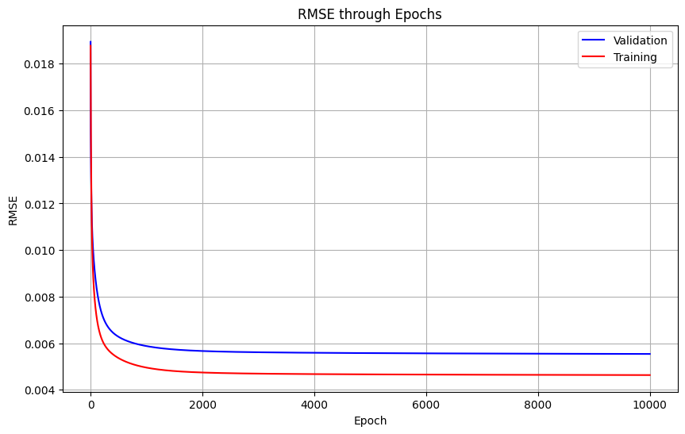
:::
:::

::: {.cell .markdown id="B2kN1qOB33kk"}
-   It seems like the model does not overfit the training data. The
    evolvement of the training and validation losses through training
    iterations indicates a good balance between fitting the training
    data and generalizing to unseen data.
:::

::: {.cell .markdown id="0CU8Sd1V4dr0"}
#### Regularization
:::

::: {.cell .code execution_count="105" colab="{\"base_uri\":\"https://localhost:8080/\",\"height\":0}" id="VQ2zyadN3wA7" outputId="a2ce9839-13b0-442e-ada0-5b1f2bf5179b"}
``` python
# Ridge regression
ridge_red = Ridge(alpha=1, solver='auto')
ridge_red.fit(attributes, labels)
scores = cross_val_score(ridge_red, attributes, labels, cv=4, scoring='neg_mean_squared_error')
mse_scores = np.sqrt(-scores)
display_scores(mse_scores)
```

::: {.output .stream .stdout}
    Scores: [0.07027521 0.05472226 0.06205781 0.048597  ]
    Mean: 0.05891307051109453
    Standard Deviation: 0.008108204286617992
:::
:::

::: {.cell .code execution_count="106" colab="{\"base_uri\":\"https://localhost:8080/\",\"height\":0}" id="XZvxL11F4miR" outputId="b84ac79f-4b8a-4015-c013-11b6940946bc"}
``` python
# Lasso regression
lasso_reg = Lasso(alpha=1)
lasso_reg.fit(attributes, labels)
scores = cross_val_score(lasso_reg, attributes, labels, cv=4, scoring='neg_mean_squared_error')
mse_scores = np.sqrt(-scores)
display_scores(mse_scores)
```

::: {.output .stream .stdout}
    Scores: [0.12555641 0.1194689  0.12555251 0.11463689]
    Mean: 0.12130367721023297
    Standard Deviation: 0.004581232878877317
:::
:::

::: {.cell .code execution_count="107" colab="{\"base_uri\":\"https://localhost:8080/\",\"height\":0}" id="G4c7C8YM4q4d" outputId="2280829f-0da7-4a6b-c01f-9c599177aeff"}
``` python
#Elastic Net regression
elastic_reg = ElasticNet(alpha=1, l1_ratio=0.5)
elastic_reg.fit(attributes, labels)
scores = cross_val_score(elastic_reg, attributes, labels, cv=4, scoring='neg_mean_squared_error')
mse_scores = np.sqrt(-scores)
display_scores(mse_scores)
```

::: {.output .stream .stdout}
    Scores: [0.0991591  0.09267967 0.09825259 0.08532925]
    Mean: 0.09385515012150156
    Standard Deviation: 0.005512304277278116
:::
:::

::: {.cell .markdown id="rDR3lcY-4yEk"}
#### Regularization with Different Penalty Terms
:::

::: {.cell .code execution_count="108" colab="{\"base_uri\":\"https://localhost:8080/\",\"height\":542}" id="bLgK_1HQ4wFB" outputId="f5a2e58c-90b3-4661-ba85-ba4cd4029179"}
``` python
alpha_range = np.linspace(0.1, 10, 20)
ridge_rmse = []
lasso_rmse = []
elastic_rmse = []

for x in alpha_range:
  ridge_red = Ridge(alpha=x, solver='auto')
  lasso_reg = Lasso(alpha=x)
  elastic_reg = ElasticNet(alpha=x, l1_ratio=0.5)
  scores_ridge = cross_val_score(ridge_red, attributes, labels, cv=4, scoring='neg_mean_squared_error')
  scores_lasso = cross_val_score(lasso_reg, attributes, labels, cv=4, scoring='neg_mean_squared_error')
  scores_elastic_net = cross_val_score(elastic_reg, attributes, labels, cv=4, scoring='neg_mean_squared_error')
  scores_ridge = np.sqrt(-scores_ridge)
  scores_lasso = np.sqrt(-scores_lasso)
  scores_elastic_net = np.sqrt(-scores_elastic_net)
  ridge_rmse.append(scores_ridge.mean())
  lasso_rmse.append(scores_lasso.mean())
  elastic_rmse.append(scores_elastic_net.mean())

plt.figure(figsize=(10, 6))

# Plot RMSE values for Ridge
plt.plot(alpha_range, ridge_rmse, label='Ridge', marker='o', linestyle='-')

# Plot RMSE values for Lasso
plt.plot(alpha_range, lasso_rmse, label='Lasso', marker='o', linestyle='-')

# Plot RMSE values for Elastic Net
plt.plot(alpha_range, elastic_rmse, label='Elastic Net', marker='o', linestyle='-')
plt.xlabel('Alpha')
plt.ylabel('RMSE')
plt.legend()
plt.grid(True)
plt.show()
```

::: {.output .display_data}
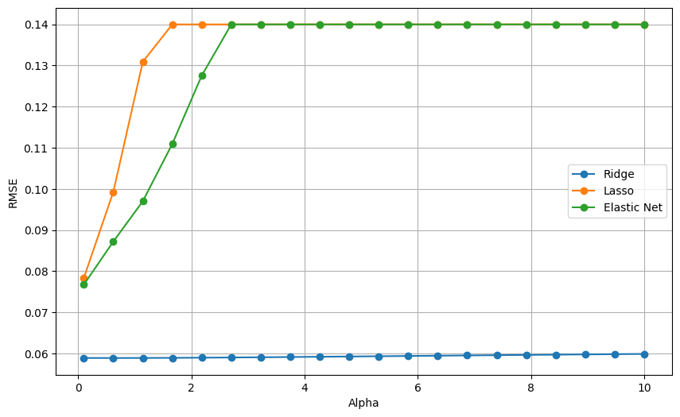
:::
:::

::: {.cell .markdown id="imygLdC05zzn"}
-   With alpha taking different values between 0.1 and 10, it appears
    that Ridge regression brings about the lowest RMSE values, notably,
    with alpha closer to 0. This suggests, that only slight
    regularization is needed for a better performance, which is
    convenient since all features will remain in the model.
-   Same goes for Lasso and Elastic Net, RMSE values increase as aplha
    values grow larger.
-   This behavior is normal as the model is already simple, and there
    are merely a few features. So, only little to no regularization is
    required for a better performance.
:::

::: {.cell .markdown id="3t2qoWU17biw"}
#### Hyper parameter Tuning and Description
:::

::: {.cell .code execution_count="187" colab="{\"base_uri\":\"https://localhost:8080/\",\"height\":557}" id="nkI8dBGB5HHq" outputId="ee3e8199-9a13-4584-a565-ac2496754015"}
``` python
# Learning rates
learning_rates = np.linspace(0.00001, 0.1, 20)
lr_rmse = []

for x in learning_rates:
  sgd_reg = SGDRegressor(penalty=None, tol = 1e-3, max_iter=10000, eta0=x)
  sgd_reg.fit(X=attributes, y=labels)
  scores = cross_val_score(sgd_reg, attributes, labels, cv=4, scoring='neg_mean_squared_error')
  rmse_scores = np.sqrt(-scores)
  lr_rmse.append(rmse_scores.mean())

plt.figure(figsize=(10, 6))

plt.plot(learning_rates, lr_rmse, label='Learning Rate', marker='o', linestyle='-')

plt.xlabel('Learning Rate')
plt.ylabel('RMSE')
plt.legend()
plt.grid(True)
plt.show()
```

::: {.output .display_data}
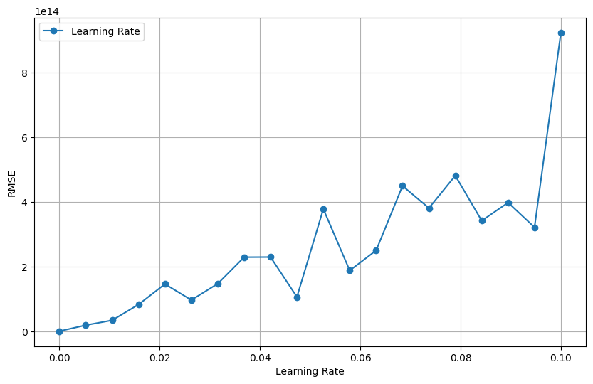
:::
:::

::: {.cell .code execution_count="188" colab="{\"base_uri\":\"https://localhost:8080/\",\"height\":542}" id="q3-qIom67qSc" outputId="f906a0b6-701d-4fe4-a2c5-cb284d1d029c"}
``` python
#Batch sizes
batch_sizes = [32, 64, 128, 256, 512]
batch_rmse = []

np.random.seed(42)

X = np.array(attributes)
y = np.array(labels)

sgd_reg = SGDRegressor(penalty=None, tol=1e-3, max_iter=10000, eta0=0.00001)

for batch_size in batch_sizes:
  shuffled_indices = np.random.permutation(len(attributes))
  X_shuffled = X[shuffled_indices]
  y_shuffled = y[shuffled_indices]
  for i in range(0, attributes.shape[0], batch_size):
    X_batch = X_shuffled[i:i+batch_size]
    y_batch = y_shuffled[i:i+batch_size]
    sgd_reg.fit(X_batch, y_batch)
  scores = cross_val_score(sgd_reg, attributes, labels, cv=4, scoring='neg_mean_squared_error')
  rmse_scores = np.sqrt(-scores)
  batch_rmse.append(rmse_scores.mean())

plt.figure(figsize=(10, 6))

plt.plot(batch_sizes, batch_rmse, label='Batch Size', marker='o', color='r', linestyle='-')

plt.xlabel('Batch Size')
plt.ylabel('RMSE')
plt.legend()
plt.grid(True)
plt.show()
```

::: {.output .display_data}
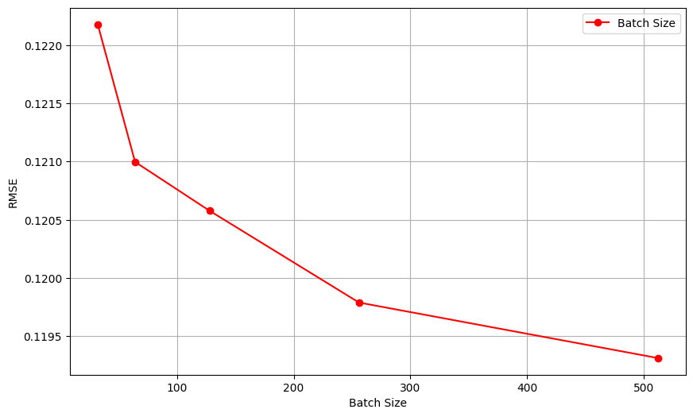
:::
:::

::: {.cell .markdown id="ieBOBk228ZLh"}
-   Upon fine tuning the model, it is safe to say that the following
    hyperparameters would optimize its performance:
-   Penalty: l2 (Ridge regression with alpha as low as 0.1)
-   Learning rate: 0.00001
-   Batch size: 512
:::

::: {.cell .markdown id="PRmsdvIh80VR"}
# Question F

Repeat the previous step with polynomial regression. Using validation
loss, explore if your model overfits/underfits the data
:::

::: {.cell .markdown id="SFM62nrj9Iyq"}
#### Closed-form Solution {#closed-form-solution}
:::

::: {.cell .code execution_count="152" id="Xqarh0Og78BT"}
``` python
poly_features = PolynomialFeatures(degree=2, include_bias=False)
attributes_poly = poly_features.fit_transform(attributes)
```
:::

::: {.cell .code execution_count="125" colab="{\"base_uri\":\"https://localhost:8080/\",\"height\":0}" id="hwcmjwwC9z00" outputId="107f90c1-dcc0-48db-96e5-e368650c8b0f"}
``` python
attributes.shape
```

::: {.output .execute_result execution_count="125"}
    (400, 8)
:::
:::

::: {.cell .code execution_count="126" colab="{\"base_uri\":\"https://localhost:8080/\",\"height\":0}" id="QE_h4QHJ9rgV" outputId="b9a81dd3-b4e8-46f0-bb66-0ae87fa869ea"}
``` python
attributes_poly.shape
```

::: {.output .execute_result execution_count="126"}
    (400, 44)
:::
:::

::: {.cell .code execution_count="148" colab="{\"base_uri\":\"https://localhost:8080/\",\"height\":0}" id="poXPleuv9xJa" outputId="ab577117-14ee-4dff-fba9-cd8c2418eb01"}
``` python
lin_reg_pol = LinearRegression()
lin_reg_pol.fit(X=attributes_poly, y=labels)
scores = cross_val_score(lin_reg, attributes_poly, labels, cv=4, scoring='neg_mean_squared_error')
rmse_scores = np.sqrt(-scores)
display_scores(rmse_scores)
```

::: {.output .stream .stdout}
    Scores: [0.10083629 0.12151943 0.11681228 0.14970604]
    Mean: 0.12221851108741759
    Standard Deviation: 0.01762441330637295
:::
:::

::: {.cell .markdown id="ta6xwc0G-PK7"}
-   Polynomial regression of degree 2 yielded the best performance as
    opposed to higher degrees that exhibited high variability across
    validation scores indicating overfitting.
:::

::: {.cell .markdown id="HH9RLj98-Zji"}
#### SGD {#sgd}
:::

::: {.cell .code execution_count="155" id="zXgY1fRM98yT"}
``` python
X_train, X_val, y_train, y_val = train_test_split(attributes_poly, labels, test_size=0.2, random_state=42)

sgd_reg_pol = SGDRegressor(penalty=None, tol = 1e-3, max_iter=10000, eta0=0.00001, warm_start=True, random_state=42)

train_losses = []
val_losses = []

epochs = 10000

for epoch in range(epochs):

  sgd_reg_pol.fit(X_train, y_train)

  y_train_predict = sgd_reg_pol.predict(X_train)
  train_loss = mean_squared_error(y_train, y_train_predict)
  train_losses.append(train_loss)

  y_val_predict = sgd_reg_pol.predict(X_val)
  val_loss = mean_squared_error(y_val, y_val_predict)
  val_losses.append(val_loss)
```
:::

::: {.cell .code execution_count="156" colab="{\"base_uri\":\"https://localhost:8080/\",\"height\":564}" id="_Z3Y0KUl-0MD" outputId="fa02dc77-9637-4e0b-cc72-1a486400e6bf"}
``` python
plt.figure(figsize=(10, 6))
plt.plot(range(10000), val_losses, label='Validation', color = 'blue')
plt.plot(range(10000), train_losses, label='Training', color = 'red')
plt.xlabel('Epoch')
plt.ylabel('RMSE')
plt.title('RMSE through Epochs')
plt.legend()
plt.grid(True)
plt.show()
```

::: {.output .display_data}
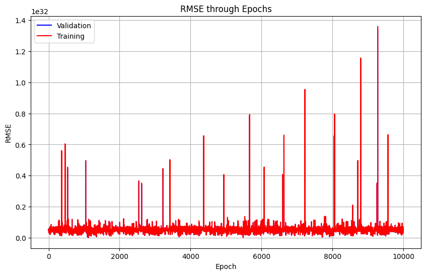
:::
:::

::: {.cell .markdown id="VTmEpsoZB3tO"}
-   The graph shows that the model does not overfit the training data
    since the validation and training curves are almost
    indistinguishable (one on top of the other).
-   RMSE values fluctuate, but they converge eventually to a minimum.
    The curves portray the behavior of stochastic gradient descent as
    the cost function keeps on bouncing up and down.
:::

::: {.cell .markdown id="VN6cw6xCFcvM"}
#### Regularization {#regularization}
:::

::: {.cell .code execution_count="160" colab="{\"base_uri\":\"https://localhost:8080/\",\"height\":0}" id="56ldBY04C0lQ" outputId="5607003e-a46c-47a0-8245-aa984818f551"}
``` python
# Ridge regression
ridge_reg_pol = Ridge(alpha=1, solver='auto')
ridge_reg_pol.fit(attributes_poly, labels)
scores = cross_val_score(ridge_reg_pol, attributes_poly, labels, cv=4, scoring='neg_mean_squared_error')
mse_scores = np.sqrt(-scores)
display_scores(mse_scores)
```

::: {.output .stream .stdout}
    Scores: [0.07061197 0.05227277 0.06273013 0.04934842]
    Mean: 0.05874082119811355
    Standard Deviation: 0.008468940749333315
:::
:::

::: {.cell .code execution_count="163" colab="{\"base_uri\":\"https://localhost:8080/\",\"height\":0}" id="jJRWmM1AFk2g" outputId="11ec471b-e162-4b3c-ed9a-dca19b156215"}
``` python
# Lasso regression
lasso_reg_pol = Lasso(alpha=1)
lasso_reg_pol.fit(attributes_poly, labels)
scores = cross_val_score(lasso_reg_pol, attributes_poly, labels, cv=4, scoring='neg_mean_squared_error')
mse_scores = np.sqrt(-scores)
display_scores(mse_scores)
```

::: {.output .stream .stdout}
    Scores: [0.07058165 0.05778268 0.06283255 0.05117434]
    Mean: 0.0605928055721686
    Standard Deviation: 0.007095734291740501
:::
:::

::: {.cell .code execution_count="164" colab="{\"base_uri\":\"https://localhost:8080/\",\"height\":0}" id="lQ3O3p9XFuIB" outputId="93ad81c5-f911-4ec4-87c3-c61eb0bee35a"}
``` python
# Elastic Net regression
elastic_reg_pol = ElasticNet(alpha=1, l1_ratio=0.5)
elastic_reg_pol.fit(attributes_poly, labels)
scores = cross_val_score(elastic_reg_pol, attributes_poly, labels, cv=4, scoring='neg_mean_squared_error')
mse_scores = np.sqrt(-scores)
display_scores(mse_scores)
```

::: {.output .stream .stdout}
    Scores: [0.07028968 0.05597102 0.06222197 0.04972746]
    Mean: 0.05955253244886399
    Standard Deviation: 0.007612020624480657
:::
:::

::: {.cell .markdown id="yhTQ4gWGGBTh"}
#### Regularization with Different Penalty Terms {#regularization-with-different-penalty-terms}
:::

::: {.cell .code execution_count="172" colab="{\"base_uri\":\"https://localhost:8080/\",\"height\":542}" id="dPSMSum-F2bZ" outputId="b94ca293-b5e5-42aa-fe6e-900d8a21cfa0"}
``` python
alpha_range = np.linspace(0.3, 10, 20)
ridge_pol_rmse = []
lasso_pol_rmse = []
elastic_pol_rmse = []

for x in alpha_range:
  ridge_red_pol = Ridge(alpha=x, solver='auto')
  lasso_reg_pol = Lasso(alpha=x)
  elastic_reg_pol = ElasticNet(alpha=x, l1_ratio=0.5)
  scores_ridge_pol = cross_val_score(ridge_red_pol, attributes_poly, labels, cv=4, scoring='neg_mean_squared_error')
  scores_lasso_pol = cross_val_score(lasso_reg_pol, attributes_poly, labels, cv=4, scoring='neg_mean_squared_error')
  scores_elastic_net = cross_val_score(elastic_reg_pol, attributes_poly, labels, cv=4, scoring='neg_mean_squared_error')
  scores_ridge_pol = np.sqrt(-scores_ridge_pol)
  scores_lasso_pol = np.sqrt(-scores_lasso_pol)
  scores_elastic_net_pol = np.sqrt(-scores_elastic_net)
  ridge_pol_rmse.append(scores_ridge.mean())
  lasso_pol_rmse.append(scores_lasso_pol.mean())
  elastic_pol_rmse.append(scores_elastic_net.mean())

plt.figure(figsize=(10, 6))

# Plot RMSE values for Ridge
plt.plot(alpha_range, ridge_rmse, label='Ridge', marker='o', linestyle='-')

# Plot RMSE values for Lasso
plt.plot(alpha_range, lasso_rmse, label='Lasso', marker='o', linestyle='-')

# Plot RMSE values for Elastic Net
plt.plot(alpha_range, elastic_rmse, label='Elastic Net', marker='o', linestyle='-')
plt.xlabel('Alpha')
plt.ylabel('RMSE')
plt.legend()
plt.grid(True)
plt.show()
```

::: {.output .display_data}
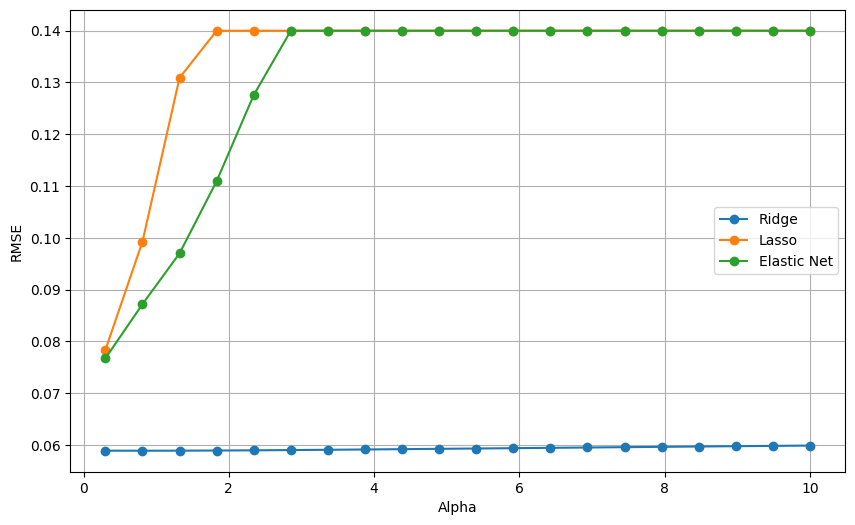
:::
:::

::: {.cell .markdown id="TOkPnRHmGu4K"}
-   Increasing alpha can decrease variability across validation scores
    and help mitigate overfitting. On the other hand, bias increases.
    This is illustrated in the figure above, as alpha values increase,
    RMSE values increase as well which indicates underfitting.
-   The model is still not complex enough to require strong
    regularization, using Elastic Net or Lasso, with alpha values
    greater than 0.3. The number of features is moderate which justifies
    not doing any feature selection using Lasso or Elastic Net.
-   Ridge regression, however, with alpha closer to 0, shows the best
    performance.
:::

::: {.cell .markdown id="YvI6-R9WJ81p"}
#### Hyperparameter Tuning and Description
:::

::: {.cell .code execution_count="189" colab="{\"base_uri\":\"https://localhost:8080/\",\"height\":557}" id="dIsTmoRNGFwb" outputId="8bd46cae-ec88-4f44-f63e-8fd0dc7a1de7"}
``` python
# Learning rates
learning_rates = np.linspace(0.00001, 0.1, 20)
lr_rmse = []

for x in learning_rates:
  sgd_reg_pol = SGDRegressor(penalty=None, tol = 1e-3, max_iter=10000, eta0=x)
  sgd_reg_pol.fit(X=attributes_poly, y=labels)
  scores = cross_val_score(sgd_reg_pol, attributes, labels, cv=4, scoring='neg_mean_squared_error')
  rmse_scores = np.sqrt(-scores)
  lr_rmse.append(rmse_scores.mean())

plt.figure(figsize=(10, 6))

plt.plot(learning_rates, lr_rmse, label='Learning Rate', marker='o', linestyle='-')

plt.xlabel('Learning Rate')
plt.ylabel('RMSE')
plt.legend()
plt.grid(True)
plt.show()
```

::: {.output .display_data}
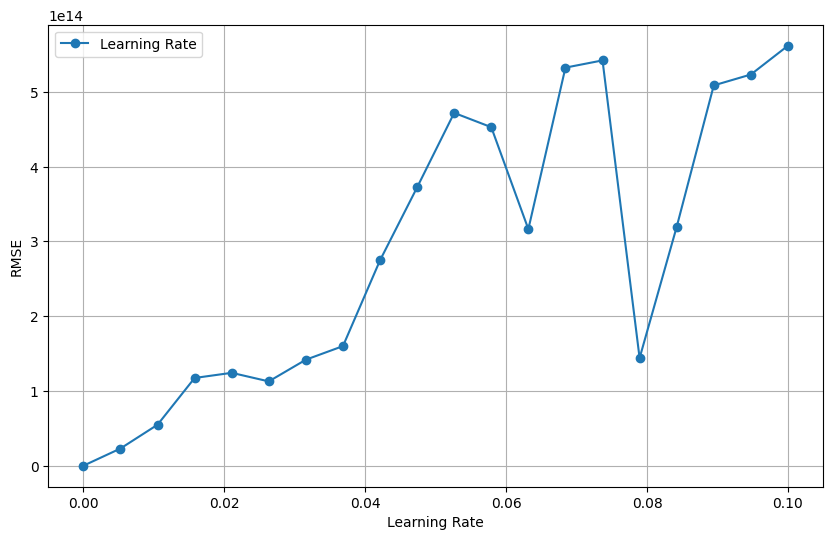
:::
:::

::: {.cell .code execution_count="190" colab="{\"base_uri\":\"https://localhost:8080/\",\"height\":557}" id="XxAHbbY_KKsB" outputId="9e29a43a-a208-467f-948a-06eca290c05e"}
``` python
# Batch sizes
batch_sizes = [32, 64, 128, 256, 512]
batch_rmse = []

np.random.seed(42)

y = np.array(labels)

sgd_reg_pol = SGDRegressor(penalty=None, tol=1e-3, max_iter=10000, eta0=0.00001)

for batch_size in batch_sizes:
  shuffled_indices = np.random.permutation(len(attributes_poly))
  X_shuffled = attributes_poly[shuffled_indices]
  y_shuffled = y[shuffled_indices]
  for i in range(0, attributes_poly.shape[0], batch_size):
    X_batch = X_shuffled[i:i+batch_size]
    y_batch = y_shuffled[i:i+batch_size]
    sgd_reg_pol.fit(X_batch, y_batch)
  scores = cross_val_score(sgd_reg_pol, attributes_poly, labels, cv=4, scoring='neg_mean_squared_error')
  rmse_scores = np.sqrt(-scores)
  batch_rmse.append(rmse_scores.mean())

plt.figure(figsize=(10, 6))

plt.plot(batch_sizes, batch_rmse, label='Batch Size', marker='o', color='r', linestyle='-')

plt.xlabel('Batch Size')
plt.ylabel('RMSE')
plt.legend()
plt.grid(True)
plt.show()
```

::: {.output .display_data}
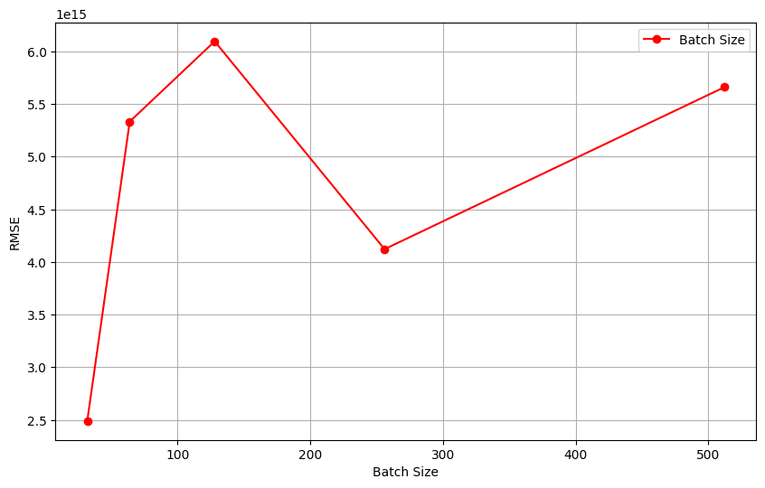
:::
:::

::: {.cell .markdown id="j_zIix9tKXkz"}
-   Upon fine tuning the polynomial regression model, it is safe to say
    that the following hyperparameters would optimize its performance:
-   Penalty: l2 (Ridge regression with alpha as low as 0.3)
-   Learning rate: 0.00001
-   Batch size: 32
:::

::: {.cell .markdown id="lOvIyWzQKqU3"}
#Question G Make predictions of the labels on the test data, using the
trained model with chosen hyperparameters. Summarize performance using
the appropriate evaluation metric. Discuss the results. Include thoughts
about what further can be explored to increase performance.
:::

::: {.cell .markdown id="lqoa3N3ei3m6"}
#### Trained Model with Hyperparameters
:::

::: {.cell .markdown id="mXD3rWNmLHOF"}
-   The best model overall would be the SGD linear regression model with
    the fine-tuned hyperparameters.
-   After training the model with Ridge regression and with no penalty,
    it turned out that it performs better without any regularization.
-   Likewise, it also turned out that plain SGD performs slightly better
    than mini-batch SGD with 512 as the batch size. This is probably due
    to trying out only a small selection of batch sizes. It could also
    be due to not using grid search and, actually; testing out the best
    combination of hyperparameters instead of evaluating hyperparameters
    individually.
:::

::: {.cell .code execution_count="241" id="ixVnf3iAKD--"}
``` python
X_train, X_val, y_train, y_val = train_test_split(attributes, labels, test_size=0.2, random_state=42)

learning_rate = 1e-05
#batch_size = 512
epochs = 10000

#alpha = 0.1

#X = np.array(X_train)
#y = np.array(y_train)

sgd_reg_final = SGDRegressor(penalty = None,
                              #alpha=alpha,
                              tol = 1e-3,
                              max_iter = 10000,
                              eta0 = learning_rate,
                              warm_start=True,
                              random_state=42)

train_losses = []
val_losses = []

for epoch in range(epochs):

  #shuffled_indices = np.random.permutation(len(X_train))
  #X_shuffled = X[shuffled_indices]
  #y_shuffled = y[shuffled_indices]

  #for i in range(0, X_train.shape[0], batch_size):
    #X_batch = X_shuffled[i:i+batch_size]
    #y_batch = y_shuffled[i:i+batch_size]
    #sgd_reg_final.fit(X_batch, y_batch)

  sgd_reg_final.fit(X_train, y_train)

  y_train_predict = sgd_reg_final.predict(X_train)
  train_loss = mean_squared_error(y_train, y_train_predict)
  train_losses.append(train_loss)

  y_val_predict = sgd_reg_final.predict(X_val)
  val_loss = mean_squared_error(y_val, y_val_predict)
  val_losses.append(val_loss)
```
:::

::: {.cell .code execution_count="242" colab="{\"base_uri\":\"https://localhost:8080/\",\"height\":564}" id="WrAIoGSULtTl" outputId="5170fdfe-40be-405b-dc0d-db5e7ee4bf3e"}
``` python
plt.figure(figsize=(10, 6))
plt.plot(range(epochs), val_losses, label='Validation', color = 'blue')
plt.plot(range(epochs), train_losses, label='Training', color = 'red')
plt.xlabel('Epoch')
plt.ylabel('RMSE')
plt.title('RMSE through iteration')
plt.legend()
plt.grid(True)
plt.show()
```

::: {.output .display_data}
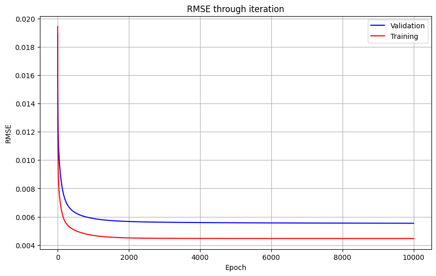
:::
:::

::: {.cell .code execution_count="248" colab="{\"base_uri\":\"https://localhost:8080/\",\"height\":0}" id="waUINIWakE60" outputId="a74b599e-5adb-4ca4-e589-669f9faf4260"}
``` python
# the coefficients
dict(zip(attributes.columns, sgd_reg_final.coef_))
```

::: {.output .execute_result execution_count="248"}
    {'GRE Score': -0.0021231071582453096,
     'TOEFL Score': 0.00512998717160416,
     'University Rating': 0.0042265828440445135,
     'SOP': 0.017161537390329346,
     'LOR ': 0.011728247599596876,
     'CGPA': 0.06952699000463283,
     'Research': 0.047163187090372004,
     'CGPA_category': 0.045766617177700364}
:::
:::

::: {.cell .code execution_count="250" colab="{\"base_uri\":\"https://localhost:8080/\",\"height\":0}" id="5eGEcTLtkQqs" outputId="434bb1c6-19c3-4c1c-d274-540de4981796"}
``` python
# the Intercept
sgd_reg_final.intercept_
```

::: {.output .execute_result execution_count="250"}
    array([-0.02400483])
:::
:::

::: {.cell .markdown id="i6sRQPfNjXtw"}
#### Making Predictions
:::

::: {.cell .code execution_count="243" colab="{\"base_uri\":\"https://localhost:8080/\",\"height\":0}" id="2LxA9G9ZN6SO" outputId="e9fc2aca-f4f2-46e7-b908-a7406fb27db1"}
``` python
attributes_test = strat_test_set.drop("Chance of Admit ", axis=1)
labels_test = strat_test_set["Chance of Admit "].copy()
attributes_test.shape, labels_test.shape
```

::: {.output .execute_result execution_count="243"}
    ((100, 8), (100,))
:::
:::

::: {.cell .code execution_count="255" id="b3dAazfzf3kM"}
``` python
predictions = sgd_reg_final.predict(attributes_test)
```
:::

::: {.cell .code execution_count="281" colab="{\"base_uri\":\"https://localhost:8080/\",\"height\":472}" id="uIe4jvf2sbXN" outputId="8e482646-9c1a-401e-d30c-79bb0974635e"}
``` python
plt.scatter(labels_test, predictions)
plt.xlabel('Actual values')
plt.ylabel('Predicted Values')
plt.title('Predictions vs Actual Values')
plt.show()
```

::: {.output .display_data}
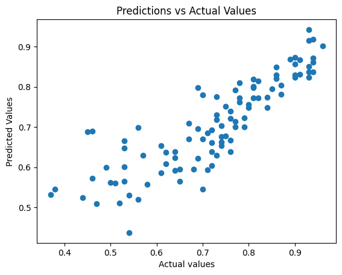
:::
:::

::: {.cell .markdown id="3V5ZDd3EmxWo"}
#### Evaluation Metric
:::

::: {.cell .code execution_count="268" id="WEZHPsWpk-qi"}
``` python
evaluation_metrics = pd.DataFrame({'Metric':['MAE','MSE','RMSE','R-Squared'],
                          'Value':[metrics.mean_absolute_error(labels_test, predictions),
                                   metrics.mean_squared_error(labels_test, predictions),
                                   np.sqrt(metrics.mean_squared_error(labels_test, predictions)),
                                   metrics.explained_variance_score(labels_test, predictions)]})
```
:::

::: {.cell .code execution_count="269" colab="{\"base_uri\":\"https://localhost:8080/\",\"height\":175}" id="fG28Jbk8l2Jd" outputId="8aa4bc55-c117-4e05-b072-a4f0474b3276"}
``` python
evaluation_metrics
```

::: {.output .execute_result execution_count="269"}
```{=html}

  <div id="df-677a65b3-e884-4cea-80dd-40c46d40c3d0" class="colab-df-container">
    <div>
<style scoped>
    .dataframe tbody tr th:only-of-type {
        vertical-align: middle;
    }

    .dataframe tbody tr th {
        vertical-align: top;
    }

    .dataframe thead th {
        text-align: right;
    }
</style>
<table border="1" class="dataframe">
  <thead>
    <tr style="text-align: right;">
      <th></th>
      <th>Metric</th>
      <th>Value</th>
    </tr>
  </thead>
  <tbody>
    <tr>
      <th>0</th>
      <td>MAE</td>
      <td>0.060799</td>
    </tr>
    <tr>
      <th>1</th>
      <td>MSE</td>
      <td>0.005831</td>
    </tr>
    <tr>
      <th>2</th>
      <td>RMSE</td>
      <td>0.076359</td>
    </tr>
    <tr>
      <th>3</th>
      <td>R-Squared</td>
      <td>0.736922</td>
    </tr>
  </tbody>
</table>
</div>
    <div class="colab-df-buttons">

  <div class="colab-df-container">
    <button class="colab-df-convert" onclick="convertToInteractive('df-677a65b3-e884-4cea-80dd-40c46d40c3d0')"
            title="Convert this dataframe to an interactive table."
            style="display:none;">

  <svg xmlns="http://www.w3.org/2000/svg" height="24px" viewBox="0 -960 960 960">
    <path d="M120-120v-720h720v720H120Zm60-500h600v-160H180v160Zm220 220h160v-160H400v160Zm0 220h160v-160H400v160ZM180-400h160v-160H180v160Zm440 0h160v-160H620v160ZM180-180h160v-160H180v160Zm440 0h160v-160H620v160Z"/>
  </svg>
    </button>

  <style>
    .colab-df-container {
      display:flex;
      gap: 12px;
    }

    .colab-df-convert {
      background-color: #E8F0FE;
      border: none;
      border-radius: 50%;
      cursor: pointer;
      display: none;
      fill: #1967D2;
      height: 32px;
      padding: 0 0 0 0;
      width: 32px;
    }

    .colab-df-convert:hover {
      background-color: #E2EBFA;
      box-shadow: 0px 1px 2px rgba(60, 64, 67, 0.3), 0px 1px 3px 1px rgba(60, 64, 67, 0.15);
      fill: #174EA6;
    }

    .colab-df-buttons div {
      margin-bottom: 4px;
    }

    [theme=dark] .colab-df-convert {
      background-color: #3B4455;
      fill: #D2E3FC;
    }

    [theme=dark] .colab-df-convert:hover {
      background-color: #434B5C;
      box-shadow: 0px 1px 3px 1px rgba(0, 0, 0, 0.15);
      filter: drop-shadow(0px 1px 2px rgba(0, 0, 0, 0.3));
      fill: #FFFFFF;
    }
  </style>

    <script>
      const buttonEl =
        document.querySelector('#df-677a65b3-e884-4cea-80dd-40c46d40c3d0 button.colab-df-convert');
      buttonEl.style.display =
        google.colab.kernel.accessAllowed ? 'block' : 'none';

      async function convertToInteractive(key) {
        const element = document.querySelector('#df-677a65b3-e884-4cea-80dd-40c46d40c3d0');
        const dataTable =
          await google.colab.kernel.invokeFunction('convertToInteractive',
                                                    [key], {});
        if (!dataTable) return;

        const docLinkHtml = 'Like what you see? Visit the ' +
          '<a target="_blank" href=https://colab.research.google.com/notebooks/data_table.ipynb>data table notebook</a>'
          + ' to learn more about interactive tables.';
        element.innerHTML = '';
        dataTable['output_type'] = 'display_data';
        await google.colab.output.renderOutput(dataTable, element);
        const docLink = document.createElement('div');
        docLink.innerHTML = docLinkHtml;
        element.appendChild(docLink);
      }
    </script>
  </div>


<div id="df-7f60b51a-2e57-42a1-bc6b-1dcda857cd72">
  <button class="colab-df-quickchart" onclick="quickchart('df-7f60b51a-2e57-42a1-bc6b-1dcda857cd72')"
            title="Suggest charts."
            style="display:none;">

<svg xmlns="http://www.w3.org/2000/svg" height="24px"viewBox="0 0 24 24"
     width="24px">
    <g>
        <path d="M19 3H5c-1.1 0-2 .9-2 2v14c0 1.1.9 2 2 2h14c1.1 0 2-.9 2-2V5c0-1.1-.9-2-2-2zM9 17H7v-7h2v7zm4 0h-2V7h2v10zm4 0h-2v-4h2v4z"/>
    </g>
</svg>
  </button>

<style>
  .colab-df-quickchart {
      --bg-color: #E8F0FE;
      --fill-color: #1967D2;
      --hover-bg-color: #E2EBFA;
      --hover-fill-color: #174EA6;
      --disabled-fill-color: #AAA;
      --disabled-bg-color: #DDD;
  }

  [theme=dark] .colab-df-quickchart {
      --bg-color: #3B4455;
      --fill-color: #D2E3FC;
      --hover-bg-color: #434B5C;
      --hover-fill-color: #FFFFFF;
      --disabled-bg-color: #3B4455;
      --disabled-fill-color: #666;
  }

  .colab-df-quickchart {
    background-color: var(--bg-color);
    border: none;
    border-radius: 50%;
    cursor: pointer;
    display: none;
    fill: var(--fill-color);
    height: 32px;
    padding: 0;
    width: 32px;
  }

  .colab-df-quickchart:hover {
    background-color: var(--hover-bg-color);
    box-shadow: 0 1px 2px rgba(60, 64, 67, 0.3), 0 1px 3px 1px rgba(60, 64, 67, 0.15);
    fill: var(--button-hover-fill-color);
  }

  .colab-df-quickchart-complete:disabled,
  .colab-df-quickchart-complete:disabled:hover {
    background-color: var(--disabled-bg-color);
    fill: var(--disabled-fill-color);
    box-shadow: none;
  }

  .colab-df-spinner {
    border: 2px solid var(--fill-color);
    border-color: transparent;
    border-bottom-color: var(--fill-color);
    animation:
      spin 1s steps(1) infinite;
  }

  @keyframes spin {
    0% {
      border-color: transparent;
      border-bottom-color: var(--fill-color);
      border-left-color: var(--fill-color);
    }
    20% {
      border-color: transparent;
      border-left-color: var(--fill-color);
      border-top-color: var(--fill-color);
    }
    30% {
      border-color: transparent;
      border-left-color: var(--fill-color);
      border-top-color: var(--fill-color);
      border-right-color: var(--fill-color);
    }
    40% {
      border-color: transparent;
      border-right-color: var(--fill-color);
      border-top-color: var(--fill-color);
    }
    60% {
      border-color: transparent;
      border-right-color: var(--fill-color);
    }
    80% {
      border-color: transparent;
      border-right-color: var(--fill-color);
      border-bottom-color: var(--fill-color);
    }
    90% {
      border-color: transparent;
      border-bottom-color: var(--fill-color);
    }
  }
</style>

  <script>
    async function quickchart(key) {
      const quickchartButtonEl =
        document.querySelector('#' + key + ' button');
      quickchartButtonEl.disabled = true;  // To prevent multiple clicks.
      quickchartButtonEl.classList.add('colab-df-spinner');
      try {
        const charts = await google.colab.kernel.invokeFunction(
            'suggestCharts', [key], {});
      } catch (error) {
        console.error('Error during call to suggestCharts:', error);
      }
      quickchartButtonEl.classList.remove('colab-df-spinner');
      quickchartButtonEl.classList.add('colab-df-quickchart-complete');
    }
    (() => {
      let quickchartButtonEl =
        document.querySelector('#df-7f60b51a-2e57-42a1-bc6b-1dcda857cd72 button');
      quickchartButtonEl.style.display =
        google.colab.kernel.accessAllowed ? 'block' : 'none';
    })();
  </script>
</div>
    </div>
  </div>
```
:::
:::

::: {.cell .markdown id="gVtwquKSmpJR"}
-   Since the evaluation metrics\' values are all close to 0, we can
    conclude that the model\'s performance is very good as it predicts
    values that are close to the actual chances of admission.
-   RMSE would be the evaluation metric of choice in this case seen that
    it is a very common regression evaluation metric that has the same
    units as the target variable making it easily interpretable.
-   According to RMSE, the predictions of the model differ by
    approximatly 0.076 units from the actual value. In other words, the
    model is correct around 93% of the time.
:::

::: {.cell .markdown id="lmfSCv3Apu7E"}
#### Summary and Future Work
:::

::: {.cell .markdown id="eQ3dCMZSrZSc"}
-   The linear regression model perfoms very well as it predicts the
    chance of admission based on different features.
-   The ***CGPA***, ***TOEFL Score*** and ***GRE Score*** are regarded
    to be the most promising features in predicting the change of
    admission. They could also be insightful in predicting one another
    as scores as well as ***Research***, ***SOP*** and ***LOR***
    strengths.
-   The model is very simple and the dataset is just as simple. With
    more data (more than 500 entries), the model could perfom better.
-   More features could be added to the model for better accuracy such
    as the acceptance rate of the university and grades in selected
    subjects.
-   Future work would touch upon using grid search to fine-tune the
    model. This would yield better hyperparameters through assessing
    different combinations rather than testing each hyperparameter on
    its own.
-   As simple as it is, this model could be actually helpful for
    graduate students to match schools with their profiles.
:::
